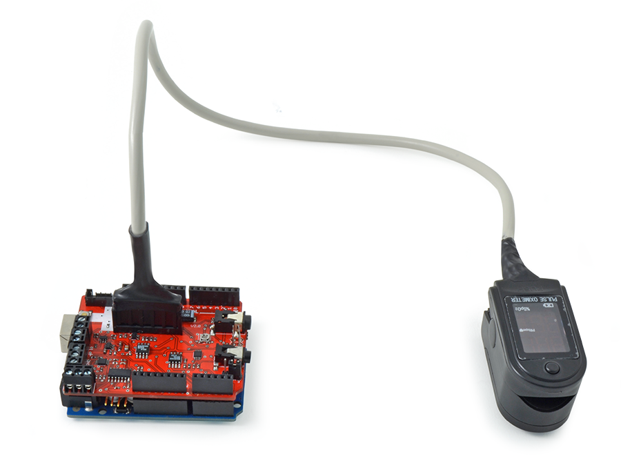
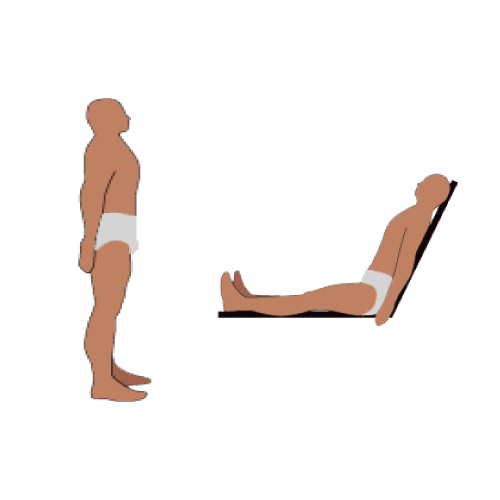
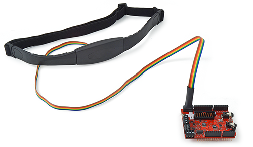

# e-Health Sensor Platform V2.0 for Arduino, Raspberry Pi

**Biometric / Medical Applications**

> Original documentation: Cooking Hacks — e-Health Sensor Platform V2.0 (link defunct)
> Mirrored/adapted from: projects-raspberry.com (link defunct) — source saved as [V2-POST.html](V2-POST.html)

---

## Contents

- [Introduction](#introduction)
- [Library Installation](#library-installation)

**Sensors**
- [1. Pulse and Oxygen in Blood (SPO2)](#1-pulse-and-oxygen-in-blood-spo2)
- [2. Airflow Sensor (Breathing)](#2-airflow-sensor-breathing)
- [3. Body Temperature](#3-body-temperature)
- [4. Electrocardiogram Sensor (ECG)](#4-electrocardiogram-sensor-ecg)
- [5. Glucometer](#5-glucometer)
- [6. Galvanic Skin Response (GSR — Sweating)](#6-galvanic-skin-response-gsr--sweating)
- [7. Blood Pressure (Sphygmomanometer)](#7-blood-pressure-sphygmomanometer)
- [8. Patient Position (Accelerometer)](#8-patient-position-accelerometer)
- [9. Electromyography (EMG)](#9-electromyography-emg) *(V2 only — not present on V1)*

**Reference**
- [API Reference](#api-reference)

---

## Introduction

The **e-Health Sensor Shield V2.0** allows Arduino and Raspberry Pi users to perform biometric and medical applications where body monitoring is needed by using 10 different sensors:

- Pulse and Oxygen in Blood (SPO2)
- Airflow (Breathing)
- Body Temperature
- Electrocardiogram (ECG)
- Glucometer
- Galvanic Skin Response (GSR — Sweating)
- Blood Pressure (Sphygmomanometer)
- Patient Position (Accelerometer)
- Electromyography (EMG)

This information can be used to monitor in real time the state of a patient or to get sensitive data in order to be subsequently analysed for medical diagnosis.

Biometric information gathered can be wirelessly sent using any of the 6 connectivity options available: **Wi-Fi, 3G, GPRS, Bluetooth, 802.15.4 and ZigBee**, depending on the application.

If real-time image diagnosis is needed, a camera can be attached to the 3G module in order to send photos and videos of the patient to a medical diagnosis centre.

Data can be sent to the Cloud for permanent storage or visualised in real time by sending the data directly to a laptop or smartphone. iPhone and Android applications have been designed to easily display the patient's information.

The e-Health Sensor Platform has been designed by **Cooking Hacks** (the open hardware division of Libelium) to help researchers, developers and artists to measure biometric sensor data for experimentation, fun and test purposes.

> **Important safety notice:** This platform is intended for **research and experimentation only**. It must NOT be used for clinical diagnosis or for patients with medical implants. Some sensors may pass a small current through the body; consult a medical professional before use.

---

## Library Installation

### Arduino

The libraries are already in this repository:

Copy these folders from `arduino/libraries/` into your Arduino sketchbook `libraries/` folder:

```
Arduino/libraries/eHealth
Arduino/libraries/PinChangeInt
Arduino/libraries/SoftwareSerial  (optional)
```

For full step-by-step instructions including Arduino IDE 2.x, see [V1-NOTES.md § 3](V1-NOTES.md#3-installing-the-libraries-in-arduino-ide-238).

### Raspberry Pi (reference only)

The RPi binary source and `arduPi` compatibility layer live in [`ardupi/`](ardupi/) — treated as read-only reference in this repo. See [`ardupi/README.md`](ardupi/README.md) for build instructions.

---

## 1. Pulse and Oxygen in Blood (SPO2)

### Overview

Pulse oximetry is a non-invasive method of measuring the arterial oxygen saturation of functional haemoglobin.

Oxygen saturation is defined as the amount of oxygen dissolved in blood, based on the detection of Haemoglobin (Hb) and Deoxyhaemoglobin. Two light wavelengths are used:

- **660 nm** (red) — higher absorption in deoxygenated Hb
- **940 nm** (infrared) — higher absorption in oxygenated HbO₂

A photo-detector measures the non-absorbed light from the LEDs to calculate arterial oxygen saturation.

**Normal ranges:**
| Condition | SpO₂ Range |
|-----------|-----------|
| Normal | 95 – 99% |
| Hypoxic drive | 88 – 94% |
| Carbon monoxide poisoning | ~100% (misleading) |

The sensor is useful in intensive care, operating theatre, recovery, emergency, and ward settings, as well as for pilots in unpressurised aircraft.

### Connecting the Sensor

Connect the module to the e-Health sensor platform connector. The sensor has only one way of connection to prevent errors.



Insert your finger into the sensor and press the `ON` button. After a few seconds, values appear on the sensor screen.

### Library Functions

**Required additional library:**

```cpp
#include <PinChangeInt.h>
```

**Attaching the interrupt:**

```cpp
PCintPort::attachInterrupt(6, readPulsioximeter, RISING);
```

Digital pin 6 is where the sensor sends the interrupt signal. The `readPulsioximeter` callback is executed on each rising edge.

**Interrupt service routine (must always be included):**

```cpp
void readPulsioximeter() {
    cont++;
    if (cont == 50) { // Sample every 50 interrupts to reduce latency
        eHealth.readPulsioximeter();
        cont = 0;
    }
}
```

**Initialisation (in `setup()`):**

```cpp
eHealth.initPulsioximeter();
```

**Reading values:**

```cpp
int spo2 = eHealth.getOxygenSaturation(); // Returns SpO2 percentage (0–100)
int bpm  = eHealth.getBPM();              // Returns beats per minute
```

### Example Sketch

```cpp
#include <PinChangeInt.h>
#include <eHealth.h>

int cont = 0;

void setup() {
    Serial.begin(115200);
    eHealth.initPulsioximeter();

    // Attach interrupt for pulsioximeter
    PCintPort::attachInterrupt(6, readPulsioximeter, RISING);
}

void loop() {
    Serial.print("PRbpm : ");
    Serial.print(eHealth.getBPM());

    Serial.print("    %SPo2 : ");
    Serial.print(eHealth.getOxygenSaturation());

    Serial.print("\n");
    Serial.println("=============================");
    delay(500);
}

// Always include this when using the pulsioximeter sensor
void readPulsioximeter() {
    cont++;
    if (cont == 50) { // Get only one of every 50 measures to reduce latency
        eHealth.readPulsioximeter();
        cont = 0;
    }
}
```

Upload the code and open the Serial Monitor at **115200 baud**.

---

## 2. Airflow Sensor (Breathing)

### Overview

The airflow sensor measures breathing by detecting changes in airflow through a nasal/oral cannula. It returns a raw ADC value (0–1023) representing the airflow voltage.

**Known limitation:** The sensor does not capture the full breathing range — data may be missing during very low-breathing phases. See [Known Platform Issues](CLAUDE.md#known-platform-issues).

### Connecting the Sensor

Connect the airflow ribbon cable to the e-Health board's airflow connector. Place the nasal cannula comfortably on the patient.

### Library Functions

**Reading airflow:**

```cpp
int air = eHealth.getAirFlow(); // Returns 0–1023 (raw ADC)
```

**Printing a waveform to Serial Monitor:**

```cpp
eHealth.airFlowWave(air); // Prints a text-based waveform representation
```

### Example Sketch

```cpp
#include <eHealth.h>

void setup() {
    Serial.begin(115200);
}

void loop() {
    int air = eHealth.getAirFlow();
    eHealth.airFlowWave(air);
}
```

Upload the code and open the Serial Monitor at **115200 baud** to see a real-time breathing waveform.

---

## 3. Body Temperature

### Overview

The temperature sensor uses a **NTC thermistor** in a Wheatstone bridge circuit to measure corporal (skin surface) temperature. An operational amplifier amplifies the bridge output voltage, which is then read via the Arduino's ADC on pin **A3**.

The library performs the NTC-to-temperature conversion using segment-wise logarithmic curve fitting:

| Resistance Range | Temperature Range | Formula |
|-----------------|-------------------|---------|
| ≥ 1822.8 Ω | 25 – 29.9 °C | R(T) = 6638.20457 × 0.95768^T |
| ≥ 1477.1 Ω | 30 – 34.9 °C | R(T) = 6403.49306 × 0.95883^T |
| ≥ 1204.8 Ω | 35 – 39.9 °C | R(T) = 6118.01620 × 0.96008^T |
| ≥ 988.1 Ω | 40 – 44.9 °C | R(T) = 5859.06368 × 0.96112^T |
| ≥ 811.7 Ω | 45 – 50.0 °C | R(T) = 5575.94572 × 0.96218^T |

### Connecting the Sensor

Connect the temperature sensor cable to the dedicated connector on the e-Health board. Attach the probe to the patient's skin surface (e.g. fingertip or wrist).

### Library Functions

**Reading temperature:**

```cpp
float temp = eHealth.getTemperature(); // Returns temperature in °C
```

No initialisation is required for this sensor.

### Example Sketch

```cpp
#include <eHealth.h>

void setup() {
    Serial.begin(115200);
}

void loop() {
    float temperature = eHealth.getTemperature();

    Serial.print("Temperature (°C): ");
    Serial.print(temperature, 2);
    Serial.println("");

    delay(1000); // Wait one second
}
```

Upload and open the Serial Monitor at **115200 baud**.

---

## 4. Electrocardiogram Sensor (ECG)

### Overview

The ECG sensor measures the electrical activity of the heart via electrodes placed on the body. The signal is amplified and output as a voltage (0–5 V) read via Arduino's analog pin **A0**.

The raw ECG waveform can be plotted in real time using the Arduino IDE's Serial Plotter or third-party tools (e.g. KST).

**Note:** ECG data from this platform is noisy and requires post-processing for clinical interpretation. See [Known Platform Issues](CLAUDE.md#known-platform-issues).

### Connecting the Sensor

Attach the three ECG electrodes to the patient:

- **Right Arm (RA)** — right side of the chest
- **Left Arm (LA)** — left side of the chest
- **Right Leg (RL)** — lower right abdomen (reference/ground)

Connect the electrode cable to the ECG connector on the e-Health board.

### Library Functions

**Reading ECG voltage:**

```cpp
float ecg = eHealth.getECG(); // Returns voltage 0.0–5.0 V
```

No initialisation is required.

### Example Sketch

```cpp
#include <eHealth.h>

void setup() {
    Serial.begin(115200);
}

void loop() {
    float ECG = eHealth.getECG();

    Serial.print("ECG value :  ");
    Serial.print(ECG, 2);
    Serial.print(" V");
    Serial.println("");

    delay(1); // 1 ms delay — high sampling rate for ECG waveform capture
}
```

Upload and open the Serial Monitor or Serial Plotter at **115200 baud**.

---

## 5. Glucometer

### Overview

The glucometer sensor allows downloading stored glucose measurements from a compatible blood glucose meter via serial communication. The meter sends data using a proprietary protocol over UART at **1200 baud**.

The library can retrieve up to **8 stored measurements** from the glucometer memory, each including date, time, and glucose concentration in mg/dL.

### Connecting the Sensor

Connect the glucometer to the e-Health board's serial interface connector. Ensure the glucometer is powered on and in data-transfer mode.

### Library Functions

**Reading all stored measurements (call in `setup()`):**

```cpp
eHealth.readGlucometer();
```

**Getting the number of stored records:**

```cpp
uint8_t n = eHealth.getGlucometerLength(); // Returns 0–8
```

**Accessing individual records:**

```cpp
eHealth.glucoseDataVector[i].day
eHealth.glucoseDataVector[i].month      // numeric (1–12)
eHealth.glucoseDataVector[i].year       // years since 2000
eHealth.glucoseDataVector[i].hour
eHealth.glucoseDataVector[i].minutes
eHealth.glucoseDataVector[i].glucose    // mg/dL
eHealth.glucoseDataVector[i].meridian   // 0xAA = am, 0xBB = pm
```

**Converting month number to name:**

```cpp
String monthName = eHealth.numberToMonth(month); // e.g. "January"
```

### Example Sketch

```cpp
#include <eHealth.h>

void setup() {
    eHealth.readGlucometer();
    Serial.begin(115200);
    delay(100);
}

void loop() {
    uint8_t numberOfData = eHealth.getGlucometerLength();
    Serial.print(F("Number of measures : "));
    Serial.println(numberOfData, DEC);
    delay(100);

    for (int i = 0; i < numberOfData; i++) {
        Serial.println(F("=========================================="));
        Serial.print(F("Measure number "));
        Serial.println(i + 1);

        Serial.print(F("Date -> "));
        Serial.print(eHealth.glucoseDataVector[i].day);
        Serial.print(F(" of "));
        Serial.print(eHealth.numberToMonth(eHealth.glucoseDataVector[i].month));
        Serial.print(F(" of "));
        Serial.print(2000 + eHealth.glucoseDataVector[i].year);
        Serial.print(F(" at "));

        if (eHealth.glucoseDataVector[i].hour < 10) Serial.print(0);
        Serial.print(eHealth.glucoseDataVector[i].hour);
        Serial.print(F(":"));
        if (eHealth.glucoseDataVector[i].minutes < 10) Serial.print(0);
        Serial.print(eHealth.glucoseDataVector[i].minutes);

        if (eHealth.glucoseDataVector[i].meridian == 0xBB)
            Serial.println(F(" pm"));
        else if (eHealth.glucoseDataVector[i].meridian == 0xAA)
            Serial.println(F(" am"));

        Serial.print(F("Glucose value : "));
        Serial.print(eHealth.glucoseDataVector[i].glucose);
        Serial.println(F(" mg/dL"));
    }

    delay(20000);
}
```

---

## 6. Galvanic Skin Response (GSR — Sweating)

### Overview

The Galvanic Skin Response (GSR) sensor — also called **Electrodermal Activity (EDA)** — measures the electrical conductance of the skin, which varies with moisture level (sweat). It is an indicator of psychological or physiological arousal.

The sensor reads from analog pin **A2**. The library derives three values from the raw ADC reading:

| Value | Description | Unit |
|-------|-------------|------|
| Conductance | Skin electrical conductance | µSiemens (µS) |
| Resistance | Skin electrical resistance | Ohms (Ω) |
| Voltage | Raw voltage at sensor pin | Volts (V, 0–5 V) |

**Calibration note:** The constant `0.5` in the conductance formula represents the sensor's offset voltage and is an approximation. Measuring the actual offset with a multimeter and updating the library constant improves accuracy.

### Connecting the Sensor

Connect the two GSR finger electrodes (Velcro straps) to the index and middle fingers. Connect the sensor cable to the GSR port on the e-Health board.

### Library Functions

**Reading skin conductance (µS):**

```cpp
float conductance = eHealth.getSkinConductance(); // µSiemens; returns -1.0 if invalid
```

**Reading skin resistance (Ω):**

```cpp
float resistance = eHealth.getSkinResistance(); // Ohms; returns -1.0 if invalid
```

**Reading raw voltage:**

```cpp
float voltage = eHealth.getSkinConductanceVoltage(); // 0.0–5.0 V
```

### Example Sketch

```cpp
#include <eHealth.h>

void setup() {
    Serial.begin(115200);
}

void loop() {
    float conductance    = eHealth.getSkinConductance();
    float resistance     = eHealth.getSkinResistance();
    float conductanceVol = eHealth.getSkinConductanceVoltage();

    Serial.print("Conductance : ");
    Serial.print(conductance, 2);
    Serial.println(" uS");

    Serial.print("Resistance : ");
    Serial.print(resistance, 2);
    Serial.println(" Ohms");

    Serial.print("Conductance Voltage : ");
    Serial.print(conductanceVol, 4);
    Serial.println(" V");

    Serial.println();
    delay(1000);
}
```

---

## 7. Blood Pressure (Sphygmomanometer)

### Overview

The blood pressure sensor is an upper-arm sphygmomanometer that communicates via UART at **19200 baud**. It stores up to **8 historical measurements** (systolic, diastolic, pulse) with timestamps in its internal memory.

The Arduino sends a wake-up command sequence and the device replies with stored measurement records.

### Connecting the Sensor

Connect the blood pressure sensor cuff to the patient's upper arm. Connect the sensor cable to the blood pressure port on the e-Health board.

### Library Functions

**Downloading stored measurements (call in `setup()`):**

```cpp
eHealth.readBloodPressureSensor();
```

**Getting the number of stored records:**

```cpp
uint8_t n = eHealth.getBloodPressureLength(); // Returns 0–8
```

**Accessing individual records:**

```cpp
eHealth.bloodPressureDataVector[i].day
eHealth.bloodPressureDataVector[i].month      // numeric (1–12)
eHealth.bloodPressureDataVector[i].year       // years since 2000
eHealth.bloodPressureDataVector[i].hour
eHealth.bloodPressureDataVector[i].minutes
eHealth.bloodPressureDataVector[i].systolic   // mmHg (add 30 to raw value)
eHealth.bloodPressureDataVector[i].diastolic  // mmHg
eHealth.bloodPressureDataVector[i].pulse      // bpm
```

### Example Sketch

```cpp
#include <eHealth.h>

void setup() {
    eHealth.readBloodPressureSensor();
    Serial.begin(115200);
    delay(100);
}

void loop() {
    uint8_t numberOfData = eHealth.getBloodPressureLength();
    Serial.print(F("Number of measures : "));
    Serial.println(numberOfData, DEC);
    delay(100);

    for (int i = 0; i < numberOfData; i++) {
        Serial.println(F("=========================================="));
        Serial.print(F("Measure number "));
        Serial.println(i + 1);

        Serial.print(F("Date -> "));
        Serial.print(eHealth.bloodPressureDataVector[i].day);
        Serial.print(F(" of "));
        Serial.print(eHealth.numberToMonth(eHealth.bloodPressureDataVector[i].month));
        Serial.print(F(" of "));
        Serial.print(2000 + eHealth.bloodPressureDataVector[i].year);
        Serial.print(F(" at "));

        if (eHealth.bloodPressureDataVector[i].hour < 10) Serial.print(0);
        Serial.print(eHealth.bloodPressureDataVector[i].hour);
        Serial.print(F(":"));
        if (eHealth.bloodPressureDataVector[i].minutes < 10) Serial.print(0);
        Serial.println(eHealth.bloodPressureDataVector[i].minutes);

        Serial.print(F("Systolic value : "));
        Serial.print(30 + eHealth.bloodPressureDataVector[i].systolic);
        Serial.println(F(" mmHg"));

        Serial.print(F("Diastolic value : "));
        Serial.print(eHealth.bloodPressureDataVector[i].diastolic);
        Serial.println(F(" mmHg"));

        Serial.print(F("Pulse value : "));
        Serial.print(eHealth.bloodPressureDataVector[i].pulse);
        Serial.println(F(" bpm"));
    }

    delay(20000);
}
```

---

## 8. Patient Position (Accelerometer)

### Overview

The patient position sensor uses the **MMA8452Q triple-axis accelerometer** (I²C) to detect one of five body positions. It is useful for:

- Sleep apnea and restless leg syndrome monitoring
- Sleep quality analysis via movement tracking
- Fall and fainting detection for elderly or disabled patients

The accelerometer supports selectable full-scale ranges: **±2g / ±4g / ±8g** and output data rates from 1.56 Hz to 800 Hz.

**Detected body positions:**

| Value | Position |
|-------|----------|
| 1 | Supine (lying face up) |
| 2 | Left lateral decubitus (lying on left side) |
| 3 | Right lateral decubitus (lying on right side) |
| 4 | Prone (lying face down) |
| 5 | Standing or sitting |

### Body Position Illustrations

| Supine | Left Lateral | Right Lateral | Prone | Sitting/Standing |
|--------|-------------|---------------|-------|-----------------|
|  |  |  |  |  |

### Connecting the Sensor

Connect the ribbon cable from the body position sensor to the e-Health board. Place the sensor flat against the patient's chest (connector facing down).



### Library Functions

**Initialisation (in `setup()`):**

```cpp
eHealth.initPositionSensor();
```

**Reading body position:**

```cpp
uint8_t position = eHealth.getBodyPosition(); // Returns 1–5 (see table above)
```

**Printing position as text to Serial:**

```cpp
eHealth.printPosition(position); // Prints e.g. "Supine position"
```

### Example Sketch

```cpp
#include <eHealth.h>

void setup() {
    Serial.begin(115200);
    eHealth.initPositionSensor();
}

void loop() {
    Serial.print("Current position : ");
    uint8_t position = eHealth.getBodyPosition();
    eHealth.printPosition(position);
    Serial.print("\n");
    delay(1000);
}
```

Upload and open the Serial Monitor at **115200 baud**. The current patient position is printed every second.

---

## 9. Electromyography (EMG)

### Overview

The EMG (Electromyography) sensor measures the electrical activity produced by skeletal muscles. It reads from analog pin **A0** (shared with ECG) and returns a raw ADC integer value (0–1023).

EMG is used for:

- Prosthetics control
- Rehabilitation monitoring
- Muscle fatigue measurement
- Human–computer interface research

**Note:** Do not use ECG and EMG simultaneously as they share the same analog input pin.

### Connecting the Sensor

Attach the EMG electrodes to the muscle group of interest (typically forearm or bicep). Connect the sensor cable to the EMG/ECG port on the e-Health board.

### Library Functions

**Reading EMG value:**

```cpp
int emg = eHealth.getEMG(); // Returns 0–1023 (raw ADC, not converted to voltage)
```

### Example Sketch

```cpp
#include <eHealth.h>

void setup() {
    Serial.begin(115200);
}

void loop() {
    int EMG = eHealth.getEMG();

    Serial.print("EMG value :  ");
    Serial.print(EMG);
    Serial.println("");

    delay(100);
}
```

---

## API Reference

Complete public API of the `eHealthClass` library (v2.0). All functions are called on the global `eHealth` object.

### Initialisation Functions

| Function | Description |
|----------|-------------|
| `eHealth.initPulsioximeter()` | Initialises the SPO2/pulse sensor; configures digital pins 6–13 as inputs |
| `eHealth.initPositionSensor()` | Initialises the MMA8452Q accelerometer via I²C |
| `eHealth.readBloodPressureSensor()` | Downloads stored measurements from the blood pressure cuff (call once in `setup()`) |
| `eHealth.readGlucometer()` | Downloads stored measurements from the glucometer (call once in `setup()`) |
| `eHealth.readPulsioximeter()` | Refreshes SPO2/BPM values from sensor display; call from interrupt handler |

### Sensor Reading Functions

| Function | Return Type | Description |
|----------|-------------|-------------|
| `eHealth.getTemperature()` | `float` | Corporal temperature in °C (25–50 °C range) |
| `eHealth.getOxygenSaturation()` | `int` | SpO₂ percentage (0–100%) |
| `eHealth.getBPM()` | `int` | Heart rate in beats per minute |
| `eHealth.getECG()` | `float` | ECG voltage in V (0.0–5.0 V), from analog pin A0 |
| `eHealth.getEMG()` | `int` | EMG raw ADC value (0–1023), from analog pin A0 |
| `eHealth.getAirFlow()` | `int` | Airflow raw ADC value (0–1023) |
| `eHealth.getSkinConductance()` | `float` | Skin conductance in µSiemens; returns -1.0 if out of range |
| `eHealth.getSkinResistance()` | `float` | Skin resistance in Ohms; returns -1.0 if out of range |
| `eHealth.getSkinConductanceVoltage()` | `float` | Raw voltage at GSR sensor pin (0.0–5.0 V) |
| `eHealth.getBodyPosition()` | `uint8_t` | Body position code (1–5) |
| `eHealth.getSystolicPressure(int i)` | `int` | Systolic pressure of record i in mmHg |
| `eHealth.getDiastolicPressure(int i)` | `int` | Diastolic pressure of record i in mmHg |
| `eHealth.getGlucometerLength()` | `uint8_t` | Number of records stored in glucometer (0–8) |
| `eHealth.getBloodPressureLength()` | `uint8_t` | Number of records stored in blood pressure sensor (0–8) |

### Utility Functions

| Function | Description |
|----------|-------------|
| `eHealth.printPosition(uint8_t position)` | Prints body position as a human-readable string to Serial |
| `eHealth.airFlowWave(int air)` | Prints a text-based airflow waveform representation to Serial |
| `eHealth.numberToMonth(int month)` | Converts a month integer (1–12) to its name string (e.g. `"January"`) |
| `eHealth.version()` | Returns the library version (2) |

### Data Structures

**Glucometer record (`glucoseData`):**

```cpp
struct glucoseData {
    uint8_t year;      // years since 2000
    uint8_t month;     // 1–12
    uint8_t day;
    uint8_t hour;
    uint8_t minutes;
    uint8_t glucose;   // mg/dL
    uint8_t meridian;  // 0xAA = am, 0xBB = pm
};

eHealth.glucoseDataVector[i]; // Access record i (up to 8 records)
```

**Blood pressure record (`bloodPressureData`):**

```cpp
struct bloodPressureData {
    uint8_t year;      // years since 2000
    uint8_t month;     // 1–12
    uint8_t day;
    uint8_t hour;
    uint8_t minutes;
    uint8_t systolic;  // raw; add 30 for mmHg
    uint8_t diastolic; // mmHg
    uint8_t pulse;     // bpm
};

eHealth.bloodPressureDataVector[i]; // Access record i (up to 8 records)
```

---

*Library developed by Luis Martín & Ahmad Saad — Libelium Comunicaciones Distribuidas S.L.*
*Licensed under GNU General Public License v3.*
*Adapted for this repository from the Cooking Hacks e-Health Sensor Platform V2.0 documentation (link defunct — source saved as [V2-POST.html](V2-POST.html)).*
