# e-Health Sensor Platform V2.0 for Arduino, Raspberry Pi

**Biometric / Medical Applications**

> Source: [projects-raspberry.com](https://projects-raspberry.com/e-health-sensor-platform-v2-0-for-arduino-and-raspberry-pi-biometric-medical-applications/)  
> Original documentation by [Cooking Hacks / Libelium](https://www.cooking-hacks.com/)

---

MySignals is the new-generation eHealth platform (successor to eHealth v2) with 16 improved sensors, better accuracy and probes, integrated WiFi/BLE, more MCU memory, TFT touchscreen, cloud storage, native mobile apps, and CE/FCC/IC certifications. The original e-Health Sensor Shield V2.0 provides Arduino/Raspberry Pi compatibility and a library to read sensors (SPO2, ECG, EMG, airflow, temperature, GSR, blood pressure, position, glucometer), visualize data, and send it via multiple radios.

### Parts used in the e-Health Sensor Platform:


- e-Health Sensor Shield
- e-Health Sensor Platform Complete Kit
- Patient Position Sensor (Accelerometer)
- Glucometer Sensor
- Body Temperature Sensor
- Blood Pressure Sensor (Sphygmomanometer) V2.0
- Pulse and Oxygen in Blood Sensor (SPO2)
- Airflow Sensor (Breathing)
- Galvanic Skin Response Sensor (GSR)
- Electrocardiogram Sensor (ECG)
- Electromyography Sensor (EMG)
- Arduino (compatible) or Raspberry Pi
- Raspberry Pi to Arduino shields connection bridge (adapter)
- GLCD or TFT screen (optional)
- UART communication modules / cables (for some sensors)
- Power supply (USB or external 12V - 2A)

**IMPORTANT:** The new generation of the eHealth Sensor Platform is called **MySignals**. You can find below a brief description and a comparative between the old eHealth v2 Platform and MySignals. If you want to go to the eHealth Tutorial just click here.

**Discover MySignals, the new eHealth and medical development platform!**

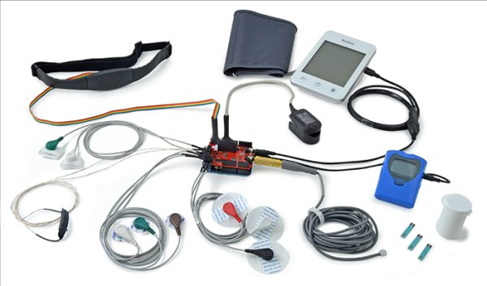

**Differences between the old eHealth Platform and MySignals**

**MySignals** is the new generation of eHealth and medical development products specifically oriented to researchers, developers and makers. It has new features that significantly improve the previous version commonly known as eHealth v2.

- The number of sensors has been increased from 10 to 16.
- The new sensors availables are: Snore, Spirometer, Blood Pressure (BLE), SPO2 (BLE), Glucometer (BLE) and Body Scale (weight, bone mass, body fat, muscle mass, body water, visceral fat, Basal Metabolic Rate and Body Mass Index).
- The accuracy of the sensors has been improved. Now we provide better and more reliable sensors.
- The sensor probes are more robust now.
- The new generation integrates a better MCU with 4 times more memory.
- WiFi and BLE radios now integrated on the PCB.
- A complete graphic system with a TFT touchscreen allows to see the data coming realtime from the sensors.
- New ‘audio type’ jack connectors allows it to be used by non technical staff.
- CE / FCC / IC certifications passed for MySignals SW.
- Cloud Storage of the data is now available to save historical information.
- Native Android / iOS App’s can be used now to visualize the information in realtime and to browse the Cloud data.


In the next tables you can see a complete comparative between eHealth v2 and the two different models of MySignals.

**GENERAL FEATURES**

|  | e-Health V2.0 | MySignals SW | MySignals HW |
|---|---|---|---|
| Architecture | Arduino compatible | Libelium IoT Core | Arduino compatible |
| RAM Memory | 2K | 8K | 2K |
| Microprocessor | Atmega 328 (Arduino UNO) | Atmega 2560 | Atmega 328 (Arduino UNO) |
| Flash Memory | 32K | 256K | 32K |
| UART sockets | 1 | 1 | 1 (multiplexed) |
| Enclosure |  |  |  |
| Complete Kitl |  |  |  |
| SDK |  |  |  |
| Screen | GLCD – optional (basic graphics) | TFT (complete graphic interface) | TFT (basic graphics) |
| TouchScreen |  |  |  |
| Cloud Storage |  |  |  |
| Android / iOS App |  |  |  |
| API Cloud |  |  |  |
| API Android/iOS |  |  |  |
| Sensors | 10 | 16 | 16 |
| Wired Sensors | 10 | 11 | 11 |
| Wireless Sensors | 10 | 16 | 16 |
| Concurrent Sensor Readings | From any sensor (10) to one interface | From any sensor (16) to one interface (TFT, BLE, WiFi) | From one group of sensors (analog, UART, BLE) to one interface (TFT, BLE, WiFi) |
| Radios on board | – | BLE, WiFi | BLE, WiFi |
| Extra Radios | BT, ZigBee, 4G / 3G / GPRS | – | BT, ZigBee, 4G / 3G / GPRS |
| Certifications | – | CE / FCC / IC | – |


**SENSORS**

| **eHealth V2.0** **MySignals SW** **MySignals HW** |
|---|
| Body Position |  |  |  |
| Body temperature |  |  |  |
| Electromyography |  |  |  |
| Electrocardiography |  |  |  |
| Airflow |  |  |  |
| Galvanic Skin Response |  |  |  |
| Blood Pressure |  |  |  |
| Pulsioximeter |  |  |  |
| Glucometer |  |  |  |
| Spirometer |  |  |  |
| Snore |  |  |  |
| Scale (BLE) |  |  |  |
| Blood Pressure (BLE) |  |  |  |
| Pulsioximeter (BLE) |  |  |  |
| Glucometer (BLE) |  |  |  |
| Electroencephalography |  |  |  |


The e-Health Sensor Shield V2.0 allows Arduino and Raspberry Pi users to perform biometric and medical applications where body monitoring is needed by using 10 different sensors: pulse, oxygen in blood (SPO2), airflow (breathing), body temperature, electrocardiogram (ECG), glucometer, galvanic skin response (GSR – sweating), blood pressure (sphygmomanometer), patient position (accelerometer) and muscle/eletromyography sensor (EMG).

This information can be used to monitor in real time the state of a patient or to get sensitive data in order to be subsequently analysed for medical diagnosis. Biometric information gathered can be wirelessly sent using any of the 6 connectivity options available: Wi-Fi, 3G, GPRS, Bluetooth, 802.15.4 and ZigBee depending on the application.

If real time image diagnosis is needed a camera can be attached to the 3G module in order to send photos and videos of the patient to a medical diagnosis center.

Data can be sent to the Cloud in order to perform permanent storage or visualized in real time by sending the data directly to a laptop or Smartphone. iPhone and Android applications have been designed in order to easily see the patient’s information.


Quick FAQ

- *What does it mean to count with an open medical monitoring platform?*


Cooking Hacks wants to give Community the necessary tools in order to develop new e-Health applications and products. We want Arduino and Raspberry Pi Community to use this platform as a quick proof of concept and the basis of a new era of open source medical products.

- *How do I ensure the privacy of the biometric data sent?*


Privacy is one of the key points in this kind of applications. For this reason the platform includes several security levels:

- In the communication link layer: AES 128 for 802.14.5 / ZigBee and WPA2 for Wifi.
- In the application layer: by using the HTTPS (secure) protocol we ensure a point to point security tunnel between each sensor node and the web server (this is the same method as used in the bank transfers).


#### *e-Health Sensor Shield over Arduino (left) Raspberry Pi (right)*


**IMPORTANT:** The e-Health Sensor Platform has been designed by Cooking Hacks (the open hardware division of Libelium) in order to help researchers, developers and artists to measure biometric sensor data for experimentation, fun and test purposes. Cooking Hacks provides a cheap and open alternative compared with the proprietary and price prohibitive medical market solutions. However, as the platform does not have medical certifications it can not be used to monitor critical patients who need accurate medical monitoring or those whose conditions must be accurately measured for an ulterior professional diagnosis.

## Get the shields and sensors


- e-Health Sensors Shield
- e-Health Sensor Platform Complete Kit


### Sensors


- Patient Position Sensor (Accelerometer)
- Glucometer Sensor
- Body Temperature Sensor
- Blood Pressure Sensor (Sphygmomanometer) V2.0
- Pulse and Oxygen in Blood Sensor (SPO2)
- Airflow Sensor (Breathing)
- Galvanic Skin Response Sensor (GSR – Sweating)
- Electrocardiogram Sensor (ECG)
- Electromyography Sensor (EMG)


## Article Index


- Features
- Electrical features
- The shield
- e-Health PCB
- The library
- e-Health shield over Arduino
- e-Health shield over Raspberry Pi
- Sensor Platform
- Pulse and Oxygen in Blood
- Electrocardiogram (ECG)
- Airflow: breathing
- Body temperature
- Blood pressure
- Patient position and falls
- Galvanic Skin Response (GSR)
- Glucometer
- Muscle/Electromyography sensor
- Visualizing the data
- LCD
- KST: Real-time data viewing and plotting
- Serial console
- SmartPhone Application
- Sending the data to the Cloud
- Wifi
- Bluetooth
- Zigbee / 802.15.4
- GPRS
- 3G
- Camera for Photo Diagnosis
- Device Compatibility
- Forum
- Get the shields and sensors
- Kits
- Sensors


## 1. Features 

The pack we are going to use in this tutorial is the eHealth Sensor platform from Cooking Hacks. The e-Health Sensor Shield is fully compatible with Raspberry and new and old Arduino USB versions, Duemilanove and Mega.

- 8 non-invasive + 1 invasive medical sensors
- Storage and use of glucose measurements.
- Monitoring ECG signal.
- Monitoring EMG signals.
- Airflow control of patient.
- Airflow control of patient.
- Body temperature data.
- Galvanic skin response measurements.
- Body position detection.
- Pulse and oxygen functions.
- Blood pressure control device.
- Multiple data visualization systems.
- Compatible with all UART device.

#### Electrical features:

The e-Health shield can be powered by the PC or by an external power supply. Some of the USB ports on computers are not able to give all the current the module needs to work, if your module have problems when it work, you can use an external power supply (12V – 2A) on the Arduino/RasberryPi.

**The shields:**

- Get Arduino
- Get the e-Health sensor shield
- Get the e-Health complete kit

#### e-Health shield over Raspberry Pi

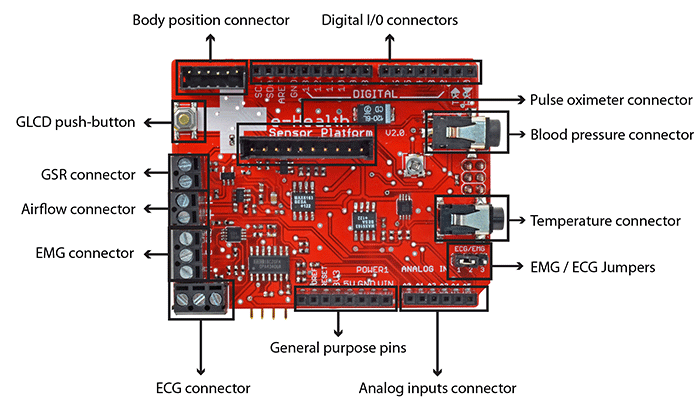


### e-Health shield over Arduino

In order to connect the e-Health Sensor Shield to Raspberry Pi an adaptor shield is needed. Click here to know more about the Raspberry Pi to Arduino Shields Connection board.

**The shields:**

- Get Raspberry Pi
- Get the Raspberry Pi to Arduino shields connection bridge
- Get the e-Health sensor shield
- Get the e-Health complete kit


Warnings:

- The LCD, the sphygmomanometer and communication modules use the UART port and can’t work simultaneously.
- The glucometer is now compatible with other UART devices and it has its own connector. But it can not work with the sphygmomanometer connected.
- The EMG sensor and the ECG can’t work simultaneously. Use the jumpers integrated in the board to use one or the other.
- To use the EMG sensor, you’ll need to have the jumpers in the EMG position. To use the ECG sensor, you’ll need to have the jumpers in the ECG configuration.


## 3. The library


Note: **these examples are written for Arduino 1.0.1**. Certain functions may not work in other versions.

The e-health Sensor Platform counts with a C++ library that lets you read easily all the sensors and send the information by using any of the available radio interfaces. This library offers an simple-to-use open source system.

In order to ensure the same code is compatible in both platforms (Arduino and Raspberry Pi) we use the ArduPi libraries which allows developers to use the same code. Detailed info can be found here:

- Raspberry Pi to Arduino shields connection bridge
- ArduPi library


#### Using the library with Arduino

The eHealth sensor platform includes a high level library functions for a easy manage of the board. This zip includes all the files needed in two separated folders, “eHealth” and “PinChangeInt”. The “PinChangeInt” library is necessary only when you use the pulsioximeter sensor. Copy this folders in the arduino IDE folder “libraries”. Don’t forget include these libraries in your codes.

Download the e-Health library for Arduino (important: V2.3 July 2014, only for eHealth kit with SPO2 model B [Yellow Sticker] )

You must download the library depending on the date of purchase.

Download the e-Health library for Arduino (important: V2.2 Juny 2014 version, SPO2 function modified)

Download the e-Health library for Arduino (important: V2.1 January 2014 version, with special function for SPO2 sensor)

Download the e-Health library for Arduino (important: V2.0 2013 version)

Libraries are often distributed as a ZIP file or folder. The name of the folder is the name of the library. Inside the folder will be the .cpp files, .h files and often a keywords.txt file, examples folder, and other files required by the library.

To install the library, first quit the Arduino application. Then uncompress the ZIP file containing the library. For installing eHealth library , uncompress eHealth.zip. It should contain a folder called “eHealth” and another called “PinChangeInt”, with files like eHealth.cpp and eHealth.h inside. Drag the eHealth and PinChange folders into this folder (your libraries folder). Under Windows, it will likely be called “My Documents\\Arduino\\libraries”. For Mac users, it will likely be called “Documents/Arduino/libraries”. On Linux, it will be the “libraries” folder in your sketchbook.

The library won’t work if you put the .cpp and .h files directly into the libraries folder or if they’re nested in an extra folder. Restart the Arduino application. Make sure the new library appears in the Sketch->Import Library menu item of the software.

That’s it! You’ve installed a library!


#### Using the library with Raspberry Pi

The e-Health library for Raspberry Pi requires the arduPi library and both libraries should be in the same path.

Download the e-Health Libraries for Raspberry (important: V2.3 July 2014, only for eHealth kit with SPO2 model B [Yellow Sticker] )

You must download the library depending on the date of purchase.

Download the e-Health Libraries for Raspberry (important: V2.0 2013 version)

Creating a program that uses the library is as simple as putting your code in this template where it says “your arduino code here”


```cpp
//Include eHealth library (it includes arduPi)
#include "eHealth.h"


/*********************************************************
 *  IF YOUR ARDUINO CODE HAS OTHER FUNCTIONS APART FROM  *
 *  setup() AND loop() YOU MUST DECLARE THEM HERE        *
 * *******************************************************/

/**************************
 * YOUR ARDUINO CODE HERE *
 * ************************/

int main (){
	setup();
	while(1){
		loop();
	}
	return (0);
}
```

Compilation of the program can be done in two ways:

- Compiling separately eHealth and arduPi, and using them for compiling the program in a second step:
```cpp
g++ -c arduPi.cpp -o arduPi.o

g++ -c eHealth.cpp -o eHealth.o

g++ -lpthread -lrt user-e-health-app.cpp arduPi.o eHealth.o -o user-e-health-app
```
- Compiling everithing in one step:
```cpp
g++ -lpthread -lrt user-e-health-app.cpp arduPi.cpp eHealth.cpp -o user-e-health-app
```


Executing your program is as simple as doing:

```cpp
sudo ./user-e-health-app
```

#### General e-Health functions


Pulsioximeter sensor functions:

```cpp
initPulsioximeter()      // It initialize the pulsioximeter sensor.
readPulsioximeter()      // It reads a value from pulsioximeter sensor.
getBPM()                 // Returns the heart beats per minute.
getOxygenSaturation()    // Returns the oxygen saturation in blood in percent.
```

ECG sensor funcion:

```cpp
getECG() // Returns an analogic value to represent the Electrocardiography.
```

EMG sensor funcion:

```cpp
getEMG() // Returns an analogic value to represent the Electromyography.
```

AirFlow sensor funcions:

```cpp
getAirFlow()  // Returns an analogic value to represent the air flow.
airFlowWave() // Prints air flow wave form in the serial monitor.
```

Temperature sensor function:

```cpp
getTemperature() // Returns the corporal temperature.
```

Blood pressure functions:

```cpp
initBloodPressureSensor() // It initialize and measure  the blood pressure sensor.
getBloodPressureSensor()  // Returns the number of data stored in the blood pressure sensor.
getSystolicPressure(i)    // Returns the  value of the systolic pressure number i.
getDiastolicPressure(i)   // Returns the  value of the diastolic pressure number i.
```

Body position sensor functions:

```cpp
initPositionSensor() // It initialize  the position sensor.
getBodyPosition()    // Returns the body position.
printPosition()      // Prints the current body position.
```

GSR sensor functions:

```cpp
getSkinConductance()        // Returns the value of skin conductance.
getSkinResistance()         // Returns the value of skin resistance.
getSkinConductanceVoltage() // Returns the value of skin conductance in voltage.
```

Glucometer sensor functions:

```cpp
readGlucometer()      // Read the values stored in the glucometer.
GetGlucometerLength() // Returns the number of data stored in the glucometer.
numberToMonth()       // Convert month variable from numeric to character.
```

## 4. Sensor Platform


### Pulse and Oxygen in Blood (SPO2)


#### SPO2 sensor features


Pulse oximetry a noninvasive method of indicating the arterial oxygen saturation of functional hemoglobin.

Oxygen saturation is defined as the measurement of the amount of oxygen dissolved in blood, based on the detection of Hemoglobin and Deoxyhemoglobin. Two different light wavelengths are used to measure the actual difference in the absorption spectra of HbO2 and Hb. The bloodstream is affected by the concentration of HbO2 and Hb, and their absorption coefficients are measured using two wavelengths 660 nm (red light spectra) and 940 nm (infrared light spectra). Deoxygenated and oxygenated hemoglobin absorb different wavelengths.

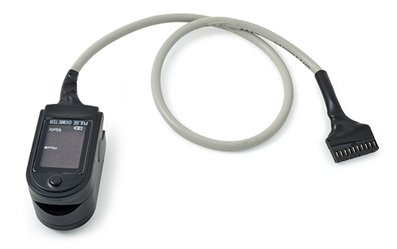

Deoxygenated hemoglobin (Hb) has a higher absorption at 660 nm and oxygenated hemoglobin (HbO2) has a higher absorption at 940 nm . Then a photo-detector perceives the non-absorbed light from the LEDs to calculate the arterial oxygen saturation.

A pulse oximeter sensor is useful in any setting where a patient’s oxygenation is unstable, including intensive care, operating, recovery, emergency and hospital ward settings, pilots in unpressurized aircraft, for assessment of any patient’s oxygenation, and determining the effectiveness of or need for supplemental oxygen.

Acceptable normal ranges for patients are from 95 to 99 percent, those with a hypoxic drive problem would expect values to be between 88 to 94 percent, values of 100 percent can indicate carbon monoxide poisoning.

The sensor needs to be connected to the Arduino or Raspberry Pi, and don’t use external/internal battery.

#### Connecting the sensor


Connect the module in the e-Health sensor platform. The sensor have only one way of connection to prevent errors and make the connection easier.

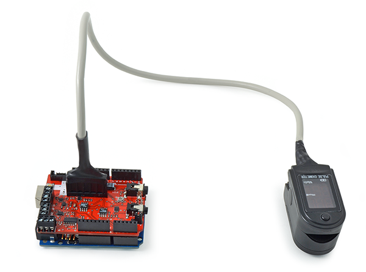

Insert your finger into the sensor and press ON button.

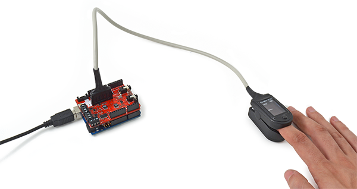

After a few seconds you will get the values in the sensor screen.

#### Library functions


**Initializing**

This sensor use interruptions and it is necessary to include a special library when you are going to use it.

```cpp
#include < PinChangeInt.h >
```

After this include, you should attach the interruptions in your code to get data from th sensor. The sensor will interrupt the process to refresh the data stored in private variables.

```cpp
PCintPort::attachInterrupt(6, readPulsioximeter, RISING);
```

The digital pin 6 of Arduino is the pin where sensor send the interruption and the function readpulsioximeter will be executed.

```cpp
void readPulsioximeter(){    
	cont ++; 
	if (cont == 50) { //Get only one 50 measures to reduce the latency
		eHealth.readPulsioximeter();  
		cont = 0;
	}
}
```

Before start using the SP02 sensor, it must be initialized. Use the next function in setup to configure some basic parameters and to start the communication between the Arduino/RaspberryPi and sensor.

**Reading the sensor**

For reading the current value of the sensor, use the next function.

Example:

```cpp
{
	eHealth.readPulsioximeter();
}
```

This function will store the values of the sensor in private variables.

**Getting data**

To view data we can get the values of the sensor stored in private variable by using the next functions.

Example:

```cpp
{
	int SPO2 = eHealth.getOxygenSaturation()
	int BPM = eHealth.getBPM()
}
```

#### Example


**Arduino**

Upload the next code for seeing data in the serial monitor:


```cpp
/*
 *  eHealth sensor platform for Arduino and Raspberry from Cooking-hacks.
 *
 *  Description: "The e-Health Sensor Shield allows Arduino and Raspberry Pi 
 *  users to perform biometric and medical applications by using 9 different 
 *  sensors: Pulse and Oxygen in Blood Sensor (SPO2), Airflow Sensor (Breathing),
 *  Body Temperature, Electrocardiogram Sensor (ECG), Glucometer, Galvanic Skin
 *  Response Sensor (GSR - Sweating), Blood Pressure (Sphygmomanometer) and 
 *  Patient Position (Accelerometer)." 
 *
 *  In this example we read the values of the pulsioximeter sensor 
 *  and we show this values in the serial monitor
 *
 *  Copyright (C) 2012 Libelium Comunicaciones Distribuidas S.L.
 *  http://www.libelium.com
 *
 *  This program is free software: you can redistribute it and/or modify
 *  it under the terms of the GNU General Public License as published by
 *  the Free Software Foundation, either version 3 of the License, or
 *  (at your option) any later version.
 *
 *  This program is distributed in the hope that it will be useful,
 *  but WITHOUT ANY WARRANTY; without even the implied warranty of
 *  MERCHANTABILITY or FITNESS FOR A PARTICULAR PURPOSE.  See the
 *  GNU General Public License for more details.
 *
 *  You should have received a copy of the GNU General Public License
 *  along with this program.  If not, see <http://www.gnu.org/licenses/>.
 *
 *  Version 2.0
 *  Author: Ahmad Saad & Luis Martin
 */


#include <PinChangeInt.h>
#include <eHealth.h>

int cont = 0;

void setup() {
  Serial.begin(115200);  
  eHealth.initPulsioximeter();

  //Attach the inttruptions for using the pulsioximeter.   
  PCintPort::attachInterrupt(6, readPulsioximeter, RISING);
}

void loop() {

  Serial.print("PRbpm : "); 
  Serial.print(eHealth.getBPM());

  Serial.print("    %SPo2 : ");
  Serial.print(eHealth.getOxygenSaturation());

  Serial.print("\n");  
  Serial.println("============================="); 
  delay(500);
}


//Include always this code when using the pulsioximeter sensor
//=========================================================================
void readPulsioximeter(){  

  cont ++;

  if (cont == 50) { //Get only of one 50 measures to reduce the latency
    eHealth.readPulsioximeter();  
    cont = 0;
  }
}
```

Upload the code to Arduino and watch the Serial monitor.Here is the USB output using the Arduino IDE serial port terminal:

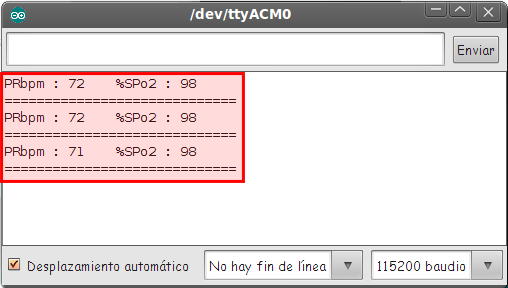

**Raspberry Pi**
Code:
```cpp
/*  
 *  eHealth sensor platform for Arduino and Raspberry from Cooking-hacks.
 *  
 *  Copyright (C) Libelium Comunicaciones Distribuidas S.L. 
 *  http://www.libelium.com 
 *  
 *  This program is free software: you can redistribute it and/or modify 
 *  it under the terms of the GNU General Public License as published by 
 *  the Free Software Foundation, either version 3 of the License, or 
 *  (at your option) any later version. 
 *  a
 *  This program is distributed in the hope that it will be useful, 
 *  but WITHOUT ANY WARRANTY; without even the implied warranty of 
 *  MERCHANTABILITY or FITNESS FOR A PARTICULAR PURPOSE.  See the 
 *  GNU General Public License for more details.
 *  
 *  You should have received a copy of the GNU General Public License 
 *  along with this program.  If not, see http://www.gnu.org/licenses/. 
 *  
 *  Version:           2.0
 *  Design:            David Gascón 
 *  Implementation:    Luis Martin & Ahmad Saad
 */

//Include eHealth library
#include < eHealth.h >

int cont = 0;

void readPulsioximeter();

void setup(){

	eHealth.initPulsioximeter();
	//Attach the inttruptions for using the pulsioximeter.
	attachInterrupt(6, readPulsioximeter, RISING);

}

void loop(){

  printf("PRbpm : %d",eHealth.getBPM());

  printf("    %%SPo2 : %d\n", eHealth.getOxygenSaturation());

  printf("=============================");

  digitalWrite(2,HIGH);

  delay(500);

}

void readPulsioximeter(){

  cont ++;
  if (cont == 500) { //Get only of one 50 measures to reduce the latency
    eHealth.readPulsioximeter();
    cont = 0;
  }
}

int main (){
	setup();
	while(1){
		loop();
	}
	return (0);
}
```

**Mobile app**

The App shows the information the nodes are sending which contains the sensor data gathered Smartphone app

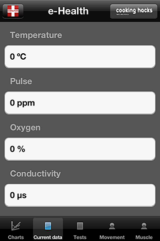

**GLCD**

The GLCD shows the information the nodes are sending which contains the sensor data gathered.GLCD


Get the Pulse and Oxygen in Blood Sensor (SPO2)

### Electrocardiogram (ECG)


#### ECG sensor features


The electrocardiogram (ECG or EKG) is a diagnostic tool that is routinely used to assess the electrical and muscular functions of the heart.

Electrocardiogram Sensor (ECG) has grown to be one of the most commonly used medical tests in modern medicine. Its utility in the diagnosis of a myriad of cardiac pathologies ranging from myocardial ischemia and infarction to syncope and palpitations has been invaluable to clinicians for decades.

The accuracy of the ECG depends on the condition being tested. A heart problem may not always show up on the ECG. Some heart conditions never produce any specific ECG changes. ECG leads are attached to the body while the patient lies flat on a bed or table.

**What is measured or can be detected on the ECG (EKG)?**

The orientation of the heart (how it is placed) in the chest cavity.

Evidence of increased thickness (hypertrophy) of the heart muscle.

Evidence of damage to the various parts of the heart muscle.

Evidence of acutely impaired blood flow to the heart muscle.

Patterns of abnormal electric activity that may predispose the patient to abnormal cardiac rhythm disturbances.

The underlying rate and rhythm mechanism of the heart.

**Schematic representation of normal ECG**

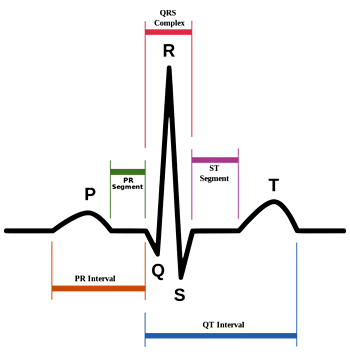

#### Connecting the sensor


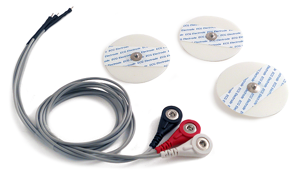

Connect the three leads (positive, negative and neutral) in the e-Health board.

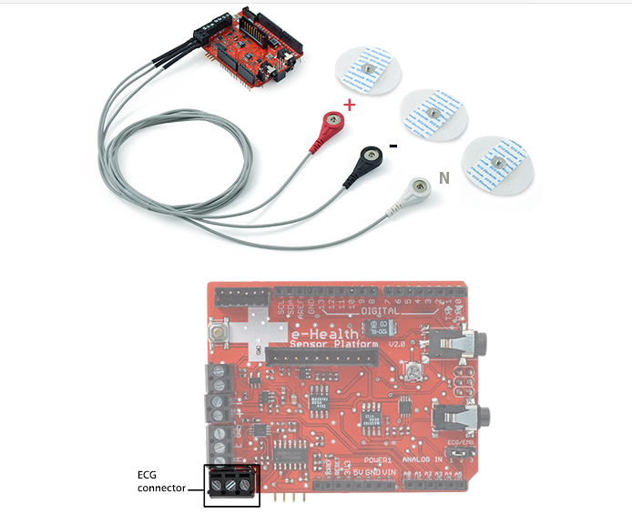

Connect the ECG lead to the electrodes.

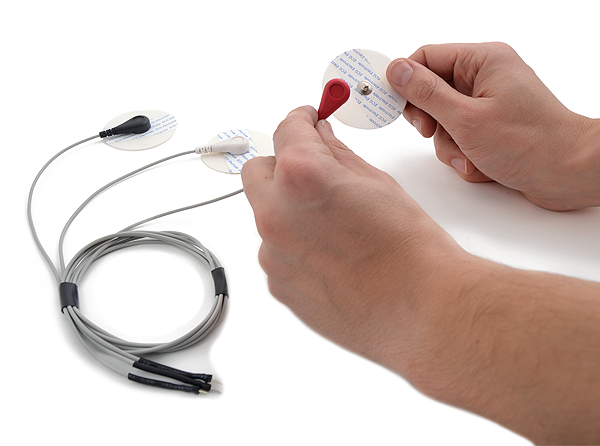

Remove the protective plastic

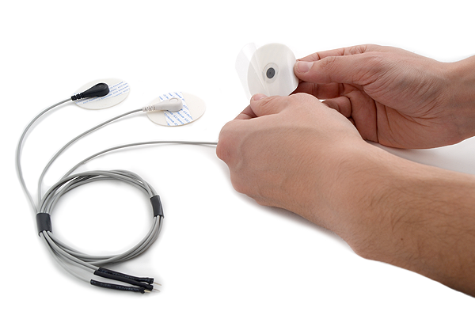

Place the electrodes as shown below

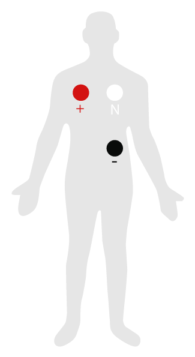


#### ECG sensor features

**Getting data**

This ECG returns an analogic value in volts (0 – 5) to represent the ECG wave form.

Example:

```cpp
{
	float ECGvolt = eHealth.getECG();
}
```

#### Example


**Arduino**

Upload the next code for seeing data in the serial monitor:

```cpp
/*  
 *  eHealth sensor platform for Arduino and Raspberry from Cooking-hacks.
 *  
 *  Copyright (C) Libelium Comunicaciones Distribuidas S.L. 
 *  http://www.libelium.com 
 *  
 *  This program is free software: you can redistribute it and/or modify 
 *  it under the terms of the GNU General Public License as published by 
 *  the Free Software Foundation, either version 3 of the License, or 
 *  (at your option) any later version. 
 *  a
 *  This program is distributed in the hope that it will be useful, 
 *  but WITHOUT ANY WARRANTY; without even the implied warranty of 
 *  MERCHANTABILITY or FITNESS FOR A PARTICULAR PURPOSE.  See the 
 *  GNU General Public License for more details.
 *  
 *  You should have received a copy of the GNU General Public License 
 *  along with this program.  If not, see http://www.gnu.org/licenses/. 
 *  
 *  Version:           2.0
 *  Design:            David Gascón 
 *  Implementation:    Luis Martin & Ahmad Saad
 */

#include < eHealth.h >

// The setup routine runs once when you press reset:
void setup() {
  Serial.begin(115200);
}

// The loop routine runs over and over again forever:
void loop() {

  float ECG = eHealth.getECG();

  Serial.print("ECG value :  ");
  Serial.print(ECG, 2);
  Serial.print(" V");
  Serial.println("");

  delay(1);	// wait for a millisecond
}
```

Upload the code and watch the Serial monitor. Here is the USB output using the Arduino IDE serial port terminal:

**Raspberry Pi**

```cpp
/*  
 *  eHealth sensor platform for Arduino and Raspberry from Cooking-hacks.
 *  
 *  Copyright (C) Libelium Comunicaciones Distribuidas S.L. 
 *  http://www.libelium.com 
 *  
 *  This program is free software: you can redistribute it and/or modify 
 *  it under the terms of the GNU General Public License as published by 
 *  the Free Software Foundation, either version 3 of the License, or 
 *  (at your option) any later version. 
 *  a
 *  This program is distributed in the hope that it will be useful, 
 *  but WITHOUT ANY WARRANTY; without even the implied warranty of 
 *  MERCHANTABILITY or FITNESS FOR A PARTICULAR PURPOSE.  See the 
 *  GNU General Public License for more details.
 *  
 *  You should have received a copy of the GNU General Public License 
 *  along with this program.  If not, see http://www.gnu.org/licenses/. 
 *  
 *  Version:           2.0
 *  Design:            David Gascón 
 *  Implementation:    Luis Martin & Ahmad Saad
 */

//Include eHealth library
#include < eHealth.h >

// The loop routine runs over and over again forever:
void loop() {

  float ECG = eHealth.getECG();

  printf("ECG value :  %f V\n",ECG);
  delay(1000);
}

int main (){
	//setup();
	while(1){
		loop();
	}
	return (0);
}
```

**Mobile App**

The App shows the information the nodes are sending which contains the sensor data gathered.Smartphone app

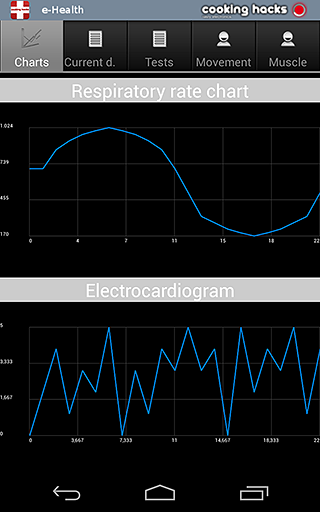

**GLCD**

The GLCD shows the information the nodes are sending which contains the sensor data gathered.GLCD

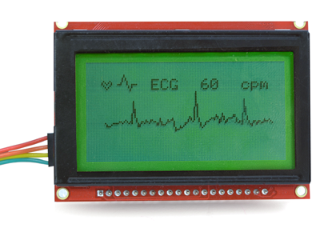

**KST**

KST program shows the ECG wave.KST

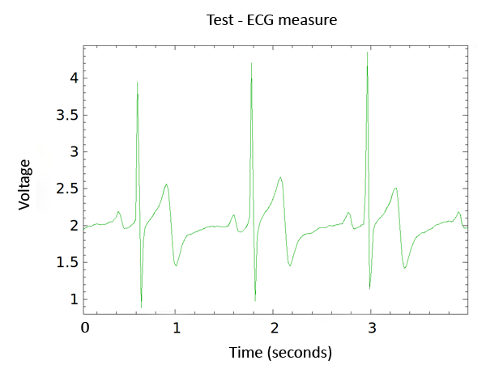

Get the Electrocardiogram Sensor (ECG)

### Airflow: breathing


#### Airflow sensor features


Anormal respiratory rates and changes in respiratory rate are a broad indicator of major physiological instability, and in many cases, respiratory rate is one of the earliest indicators of this instability. Therefore, it is critical to monitor respiratory rate as an indicator of patient status. AirFlow sensor can provide an early warning of hypoxemia and apnea.

The nasal / mouth airflow sensor is a device used to measure the breathing rate in a patient in need of respiratory help or person. This device consists of a flexible thread which fits behind the ears, and a set of two prongs which are placed in the nostrils. Breathing is measured by these prongs.

The specifically designed cannula/holder allows the thermocouple sensor to be placed in the optimal position to accurately sense the oral/nasal thermal airflow changes as well as the nasal temperature air. Comfortable adjustable and easy to install.

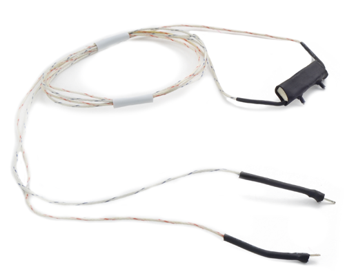

Single channel oral or nasal reusable Airflow Sensor. Stay-put prongs position sensor precisely in airflow path.

A normal adult human has a respiratory rate of 15–30 breaths per minute.

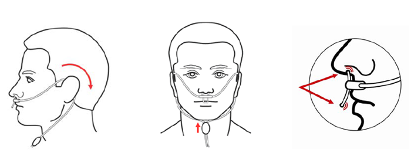

#### Connecting the sensor


The e-Health AirFlow sensor have two connections (positive and negative)

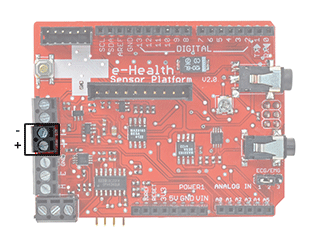

Connect the red wire with the positive terminal (marked as “+” in the board) and the black wire with the negative terminal (marked as “-” in the board)

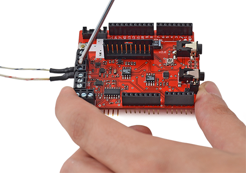

After connecting the cables, tighten the screws

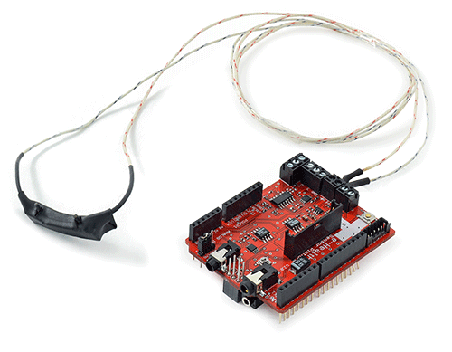

Place the sensor as shown in the picture below

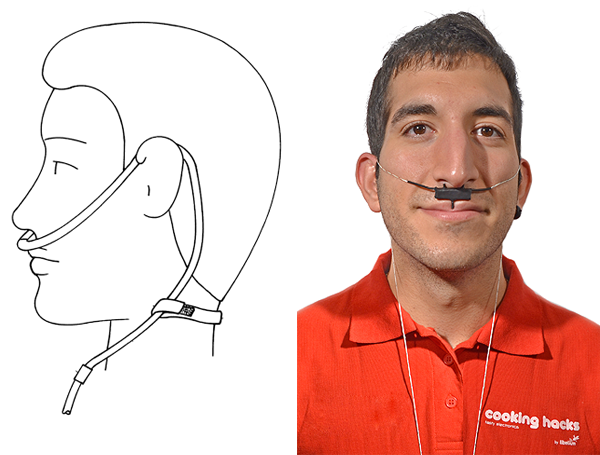

#### Library functions


**Getting data**

The air flow sensor is connected to the Arduino/RasberryPi by an analog input and returns a value from 0 to 1024. With the next functions you can get this value directly and print a wave form in the serial monitor.

**Example:**

```cpp
{
	int airFlow = eHealth.getAirFlow();
	eHealth.airFlowWave(air);
}
```

#### Example


**Arduino**

Upload the next code for seeing data in the serial monitor:

```cpp
/*  
 *  eHealth sensor platform for Arduino and Raspberry from Cooking-hacks.
 *  
 *  Copyright (C) Libelium Comunicaciones Distribuidas S.L. 
 *  http://www.libelium.com 
 *  
 *  This program is free software: you can redistribute it and/or modify 
 *  it under the terms of the GNU General Public License as published by 
 *  the Free Software Foundation, either version 3 of the License, or 
 *  (at your option) any later version. 
 *  a
 *  This program is distributed in the hope that it will be useful, 
 *  but WITHOUT ANY WARRANTY; without even the implied warranty of 
 *  MERCHANTABILITY or FITNESS FOR A PARTICULAR PURPOSE.  See the 
 *  GNU General Public License for more details.
 *  
 *  You should have received a copy of the GNU General Public License 
 *  along with this program.  If not, see http://www.gnu.org/licenses/. 
 *  
 *  Version:           2.0
 *  Design:            David Gascón 
 *  Implementation:    Luis Martin & Ahmad Saad
 */


#include < eHealth.h >

// The setup routine runs once when you press reset:
void setup() {
  Serial.begin(115200);
}

// the loop routine runs over and over again forever:
void loop() {

  int air = eHealth.getAirFlow();
  eHealth.airFlowWave(air);
}
```
 
Upload the code and watch the Serial monitor.Here is the USB output using the Arduino IDE serial port terminal:

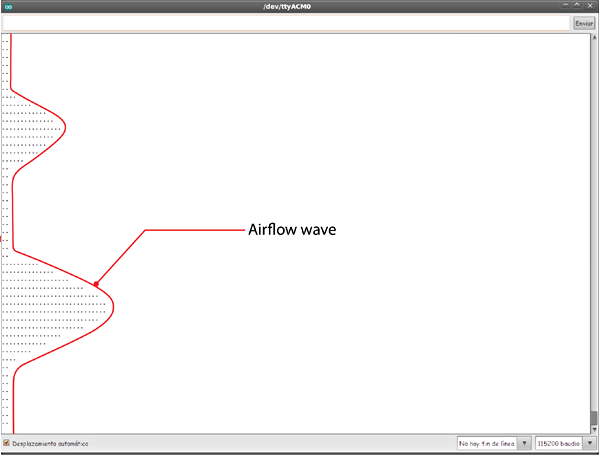

**Raspberry Pi**

Compile this example code:

```cpp
/*  
 *  eHealth sensor platform for Arduino and Raspberry from Cooking-hacks.
 *  
 *  Copyright (C) Libelium Comunicaciones Distribuidas S.L. 
 *  http://www.libelium.com 
 *  
 *  This program is free software: you can redistribute it and/or modify 
 *  it under the terms of the GNU General Public License as published by 
 *  the Free Software Foundation, either version 3 of the License, or 
 *  (at your option) any later version. 
 *  a
 *  This program is distributed in the hope that it will be useful, 
 *  but WITHOUT ANY WARRANTY; without even the implied warranty of 
 *  MERCHANTABILITY or FITNESS FOR A PARTICULAR PURPOSE.  See the 
 *  GNU General Public License for more details.
 *  
 *  You should have received a copy of the GNU General Public License 
 *  along with this program.  If not, see http://www.gnu.org/licenses/. 
 *  
 *  Version:           2.0
 *  Design:            David Gascón 
 *  Implementation:    Luis Martin & Ahmad Saad
 */

//Include eHealth library
#include < eHealth.h >

void loop() {
	int air = eHealth.getAirFlow();
	eHealth.airFlowWave(air);
	delay(50);
}

int main (){
	while(1){
		loop();
	}
	return (0);
}
```

**Mobile app**

The App shows the information the nodes are sending which contains the sensor data gathered Smartphone app

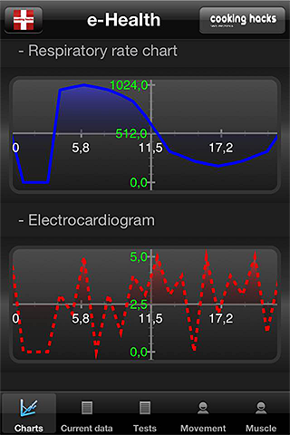

**GLCD**

The GLCD shows the information the nodes are sending which contains the sensor data gathered.GLCD

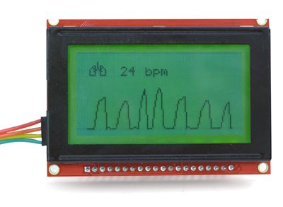

**KST**

KST program shows the airflow wave.KST

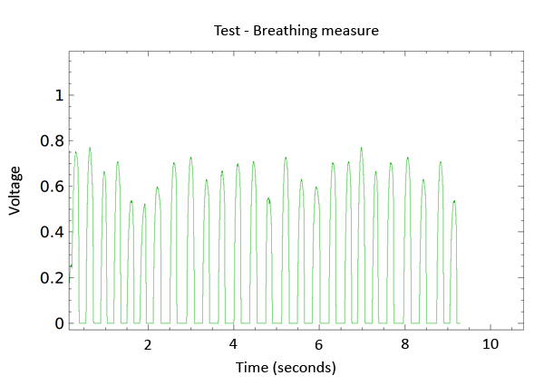

Get the Airflow Sensor (Breathing)

### Body temperature


#### Temperature sensor features


Body temperature depends upon the place in the body at which the measurement is made, and the time of day and level of activity of the person. Different parts of the body have different temperatures.

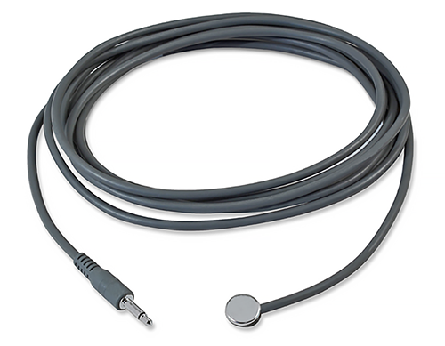

The commonly accepted average core body temperature (taken internally) is 37.0°C (98.6°F). In healthy adults, body temperature fluctuates about 0.5°C (0.9°F) throughout the day, with lower temperatures in the morning and higher temperatures in the late afternoon and evening, as the body’s needs and activities change.

It is of great medical importance to measure body temperature. The reason is that a number of diseases are accompanied by characteristic changes in body temperature. Likewise, the course of certain diseases can be monitored by measuring body temperature, and the efficiency of a treatment initiated can be evaluated by the physician.

|   |   |
|---|---|
| **Hypothermia** | <35.0 °C (95.0 °F) |
| Normal | 36.5–37.5 °C (97.7–99.5 °F) |
| Fever or Hyperthermia | >37.5–38.3 °C (99.5–100.9 °F |
| Hyperpyrexia | >40.0–41.5 °C (104–106.7 °F) |


#### Sensor Calibration


The precision of the Body Temperature Sensor is enough in most applications. But you can improve this precision by a calibration process.

When using temperature sensor, you are actually measuring a voltage, and relating that to what the operating temperature of the sensor must be. If you can avoid errors in the voltage measurements, and represent the relationship between voltage and temperature more accurately, you can get better temperature readings.

Calibration is a process of measuring voltage and resistance real values. In the eHealth.cpp file we can find getTemperature function. The values [Rc, Ra, Rb, RefTension] are imprecisely defined by default.

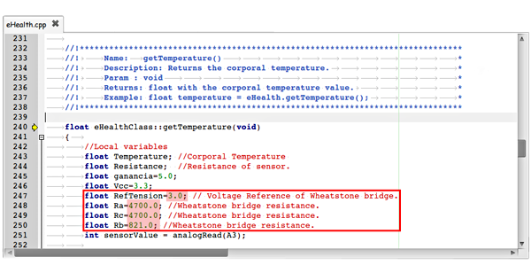

If you measure these values with a multimeter and modify the library will obtain greater accuracy.

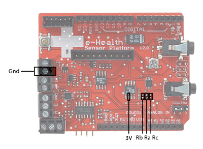

Place multimeter ends at the extremes of the resistors and measure the resistance value. In this case we would modify resistance value (Ra=4640 / Rb=819)…

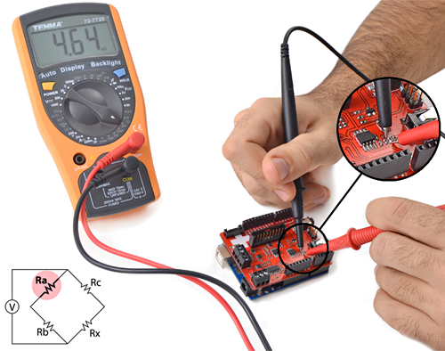

Make the same process between 3V (red cable) and GND (black cable) but with the multimeter in voltage measurement. In this case we would not change the value.

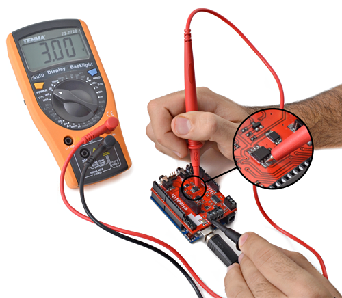

#### Connecting the sensor


For taking measures of temperature, connect the sensor in the jack connector.

Make contact between the metallic part and your skin

Use a piece of adhesive tape to hold the sensor attached to the skin

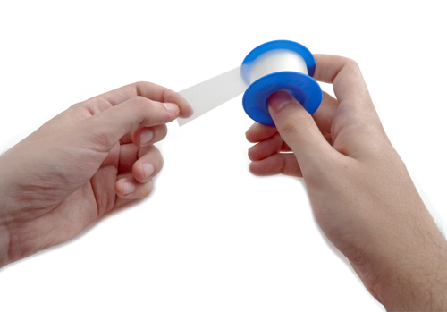

#### Library functions


**Getting data**

The corporal temperature can be taken by a simple function. This function return a float with the last value of temperature measured by the Arduino/RasberryPi.

**Example:**

```cpp
{
	float temperature = eHealth.getTemperature();
}
```

#### Example


**Arduino**

Upload the next code for seeing data in the serial monitor:

```cpp
/*  
 *  eHealth sensor platform for Arduino and Raspberry from Cooking-hacks.
 *  
 *  Copyright (C) Libelium Comunicaciones Distribuidas S.L. 
 *  http://www.libelium.com 
 *  
 *  This program is free software: you can redistribute it and/or modify 
 *  it under the terms of the GNU General Public License as published by 
 *  the Free Software Foundation, either version 3 of the License, or 
 *  (at your option) any later version. 
 *  a
 *  This program is distributed in the hope that it will be useful, 
 *  but WITHOUT ANY WARRANTY; without even the implied warranty of 
 *  MERCHANTABILITY or FITNESS FOR A PARTICULAR PURPOSE.  See the 
 *  GNU General Public License for more details.
 *  
 *  You should have received a copy of the GNU General Public License 
 *  along with this program.  If not, see http://www.gnu.org/licenses/. 
 *  
 *  Version:           2.0
 *  Design:            David Gascón 
 *  Implementation:    Luis Martin & Ahmad Saad
 */

#include < eHealth.h >

// the setup routine runs once when you press reset:
void setup() {
  Serial.begin(115200);
}

// the loop routine runs over and over again forever:
void loop() {
  float temperature = eHealth.getTemperature();

  Serial.print("Temperature (ºC): ");
  Serial.print(temperature, 2);
  Serial.println("");

  delay(1000);	// wait for a second
}
```

Upload the code and watch the Serial monitor. Here is the USB output using the Arduino IDE serial port terminal:

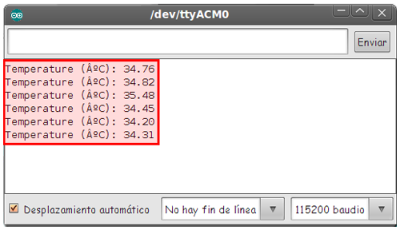

**Raspberry Pi**

Compile the following example code:

```cpp
/*  
 *  eHealth sensor platform for Arduino and Raspberry from Cooking-hacks.
 *  
 *  Copyright (C) Libelium Comunicaciones Distribuidas S.L. 
 *  http://www.libelium.com 
 *  
 *  This program is free software: you can redistribute it and/or modify 
 *  it under the terms of the GNU General Public License as published by 
 *  the Free Software Foundation, either version 3 of the License, or 
 *  (at your option) any later version. 
 *  a
 *  This program is distributed in the hope that it will be useful, 
 *  but WITHOUT ANY WARRANTY; without even the implied warranty of 
 *  MERCHANTABILITY or FITNESS FOR A PARTICULAR PURPOSE.  See the 
 *  GNU General Public License for more details.
 *  
 *  You should have received a copy of the GNU General Public License 
 *  along with this program.  If not, see http://www.gnu.org/licenses/. 
 *  
 *  Version:           2.0
 *  Design:            David Gascón 
 *  Implementation:    Luis Martin & Ahmad Saad
 */

//Include eHealth library
#include < eHealth.h >

void loop() {
	float temperature = eHealth.getTemperature();
	printf("Temperature : %f \n", temperature);
	delay(2000);
}

int main (){
	//setup();
	while(1){
		loop();
	}
	return (0);
}
```

**Mobile App**

The App shows the information the nodes are sending which contains the sensor data gathered Smartphone app

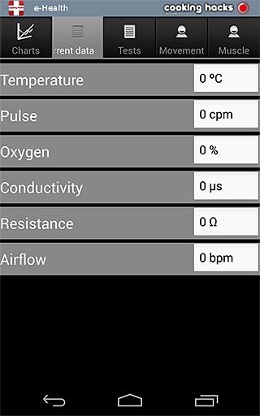

**GLCD**

The GLCD shows the information the nodes are sending which contains the sensor data gathered.GLCD


Get the Body Temperature Sensor

### Blood pressure


#### Blood pressure sensor features


Blood pressure is the pressure of the blood in the arteries as it is pumped around the body by the heart. When your heart beats, it contracts and pushes blood through the arteries to the rest of your body. This force creates pressure on the arteries. Blood pressure is recorded as two numbers—the systolic pressure (as the heart beats) over the diastolic pressure (as the heart relaxes between beats).

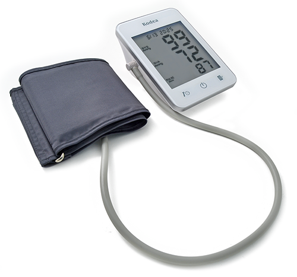

Monitoring blood pressure at home is important for many people, especially if you have high blood pressure. Blood pressure does not stay the same all the time. It changes to meet your body’s needs. It is affected by various factors including body position, breathing or emotional state, exercise and sleep. It is best to measure blood pressure when you are relaxed and sitting or lying down.

**Classification of blood pressure for adults (18 years and older)**

|  | Systolic (mm Hg) | Diastolic (mm Hg) |
| Hypotension | < 90 | < 60 |
| Desired | 90–119 | 60–79 |
| Prehypertension | 120–139 | 80–89 |
| Stage 1 Hypertension | 140–159 | 90–99 |
| Stage 2 Hypertension | 160–179 | 100–109 |
| Hypertensive Crisis | ≥ 180 | ≥ 110 |


High blood pressure (hypertension) can lead to serious problems like heart attack, stroke or kidney disease. High blood pressure usually does not have any symptoms, so you need to have your blood pressure checked regularly.

**SPECIAL FEATURES:**

- Automatic measurement of systolic, diastolic and pulse with time & date
- Large LCD screen with LED backlight
- TOUCH PAD KEY
- 80 measurement results with time & date stored in the device


**KEY SPECIFICATIONS:**

- Measurement method:Oscillometric system
- Display type：Digital LCD 97mm [L] x 87mm [W]
- Measuring range: Pressure 0-300 mmHg
- Pulse 30~200 p/min
- Measuring accuracy: Pressure≤±3 mmHg
- Pulse≤5%
- Operating environment: Temperature 10-40℃
- Relative humidity≤80%
- Power source: 4 x AA batteries
- Dimension: 150mm [L] x 110mm [W] x 65mm [H]
- Weight: About 370g
- Cuff size: 520mm [L] x 135mm [W]
- Cuff range: 220mm [L] – 320mm [W]


#### Compatible with ehealth V1


The new Blood Pressure Sensor (Sphygmomanometer) is compatible with e-Health Sensor Shield version 1 using an adapter cable.

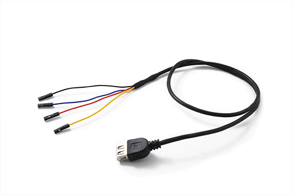

The connection of this sensor in other e-Health versions is very simple. You must use the GLCD connector and connect the device as shown in the next picture.

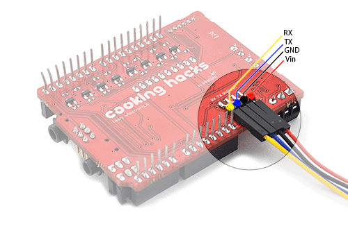

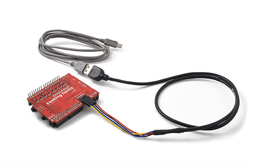

This sensor only runs with the updated e-Health library. So it is necessary to follow the same next steps.
**NOTE:** The LCD, the sphygmomanometer and communication modules use the UART port and can’t work simultaneously.
#### Connecting the sensor


Before start using the sphygmomanometer we need one measure at least in the memory of the blood pressure sensor. After that we can get all the information contained in the device.

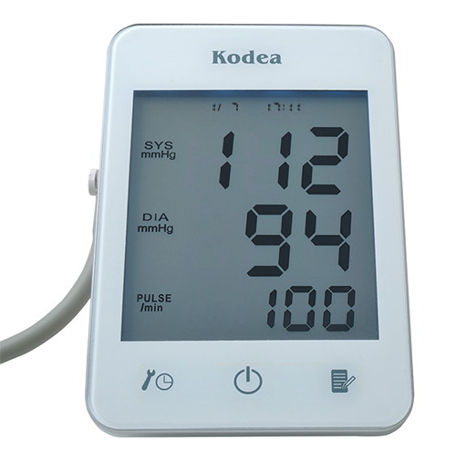

Place the sphygmomanometer on your arm (biceps zone) as shown in the image below. Power the device.

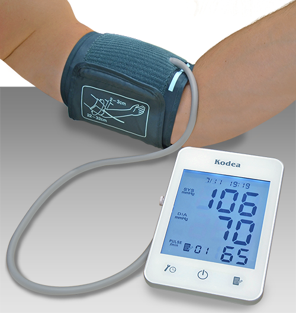

Turn on the sphygmomanometer cuff (press ON button). The sensor will begin to make a measurement. After a few seconds the result is shown in the sphygmomanometer screen.

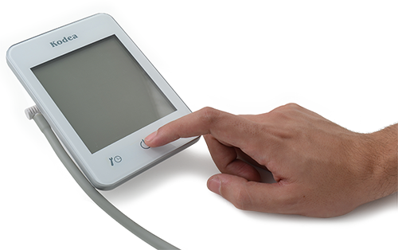

The blood pressure sensor will take a few moments to calculate the blood sugar reading. It will store the values in the memory.

In order to extract the data from the sphygmomanometer to the Arduino or Raspberry Pi, connect the cable as show in the picture.

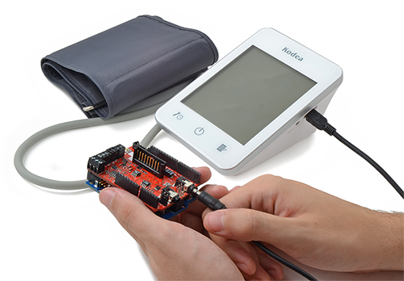

**NOTE:** If you are using this sensor in other e-Health versions you must use an adapter cable.
You should view in the sphygmomanometer screen the message “UUU”, which indicates the correct connection.

Connect the jack terminal to the e-Health board blood pressure connector and the mini-USB terminal to the sphygmomanometer.

The cable is composed of two adapter cables as shown in the following image.

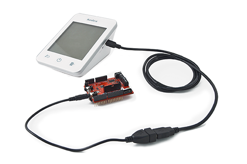

In order to measure correctly, it is important to maintain the arm and the cuff in the correct position.

Do not make abrupt movements or the measure will be not reliable.

#### Library functions


**NOTE:** You can modify the library in order to read more data. With some sketches, the buffer of the UART may be small, to increase the length of the buffer you need to change these lines in the file HardwareSerial.cpp (/arduino-1.0.X/hardware/arduino/cores/arduino):

```cpp
#if (RAMEND < 1000)
#define SERIAL_BUFFER_SIZE 32
#else
#define SERIAL_BUFFER_SIZE 256
#endif
```

by

```cpp
#if (RAMEND < 1000)
#define SERIAL_BUFFER_SIZE 256
#else
#define SERIAL_BUFFER_SIZE 256
#endif
```

You can increase the serial buffer size from 64 to 256 or 512 bytes in the Arduino.app package to have more buffer to receive the data from the BP meter.

But the serial buffer in Arduino is limited. In order to obtain more measures you could work with RaspberryPi.

Another option would be to try to store the measurement data on a SD, without showing on screen.

**Getting blood pressure data**

Some parameters must be initialized to start using blood pressure sensor (sphygmomanometer). The next function initializes some variables and reads the sphygmomanometer data.

```cpp
{
	eHealth.readBloodPressureSensor();
 	Serial.begin(115200);
}
```

The amount of data read is accessible with a another public function.

**Example of use:**

```cpp
{
	uint8_t numberOfData = eHealth.getBloodPressureLength();
	Serial.print(F("Number of measures : "));
	Serial.println(numberOfData, DEC);
	delay(100);
}
```

The next functions return the values of systolic and diastolic pressure measured by the sphygmomanometer and stored in private variables of the e-Health class.

**Example of use:**

```cpp
{
	int systolic = eHealth.getSystolicPressure(1);
	int diastolic =eHealth.getDiastolicPressure(1);
}
```

The number that we give to the function in the variable i is the number of the measurement we want to obtain.

#### Example


**Arduino**

Upload the next code for seeing data in the serial monitor:

```cpp
/*  
 *  eHealth sensor platform for Arduino and Raspberry from Cooking-hacks.
 *  
 *  Copyright (C) Libelium Comunicaciones Distribuidas S.L. 
 *  http://www.libelium.com 
 *  
 *  This program is free software: you can redistribute it and/or modify 
 *  it under the terms of the GNU General Public License as published by 
 *  the Free Software Foundation, either version 3 of the License, or 
 *  (at your option) any later version. 
 *  a
 *  This program is distributed in the hope that it will be useful, 
 *  but WITHOUT ANY WARRANTY; without even the implied warranty of 
 *  MERCHANTABILITY or FITNESS FOR A PARTICULAR PURPOSE.  See the 
 *  GNU General Public License for more details.
 *  
 *  You should have received a copy of the GNU General Public License 
 *  along with this program.  If not, see http://www.gnu.org/licenses/. 
 *  
 *  Version:           2.0
 *  Design:            David Gascón 
 *  Implementation:    Luis Martin & Ahmad Saad
 */


#include < eHealth.h >

void setup() {

  eHealth.readBloodPressureSensor();
  Serial.begin(115200);
  delay(100);
}

void loop() {

  uint8_t numberOfData = eHealth.getBloodPressureLength();
  Serial.print(F("Number of measures : "));
  Serial.println(numberOfData, DEC);
  delay(100);


  for (int i = 0; i<numberOfData; i++) {
    // The protocol sends data in this order
    Serial.println(F("=========================================="));

    Serial.print(F("Measure number "));
    Serial.println(i + 1);

    Serial.print(F("Date -> "));
    Serial.print(eHealth.bloodPressureDataVector[i].day);
    Serial.print(F(" of "));
    Serial.print(eHealth.numberToMonth(eHealth.bloodPressureDataVector[i].month));
    Serial.print(F(" of "));
    Serial.print(2000 + eHealth.bloodPressureDataVector[i].year);
    Serial.print(F(" at "));

    if (eHealth.bloodPressureDataVector[i].hour < 10) {
      Serial.print(0); // Only for best representation.
    }

    Serial.print(eHealth.bloodPressureDataVector[i].hour);
    Serial.print(F(":"));

    if (eHealth.bloodPressureDataVector[i].minutes < 10) {
      Serial.print(0);// Only for best representation.
    }
    Serial.println(eHealth.bloodPressureDataVector[i].minutes);

    Serial.print(F("Systolic value : "));
    Serial.print(30+eHealth.bloodPressureDataVector[i].systolic);
    Serial.println(F(" mmHg"));

    Serial.print(F("Diastolic value : "));
    Serial.print(eHealth.bloodPressureDataVector[i].diastolic);
    Serial.println(F(" mmHg"));

    Serial.print(F("Pulse value : "));
    Serial.print(eHealth.bloodPressureDataVector[i].pulse);
    Serial.println(F(" bpm"));
  }

  delay(20000);
}
```

Upload the code and watch the Serial monitor.Here is the USB output using the Arduino IDE serial port terminal:

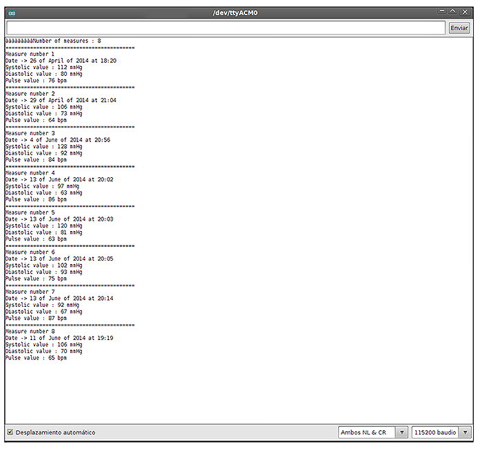

**Raspberry Pi**


```cpp
/*  
 *  eHealth sensor platform for Arduino and Raspberry from Cooking-hacks.
 *  
 *  Copyright (C) Libelium Comunicaciones Distribuidas S.L. 
 *  http://www.libelium.com 
 *  
 *  This program is free software: you can redistribute it and/or modify 
 *  it under the terms of the GNU General Public License as published by 
 *  the Free Software Foundation, either version 3 of the License, or 
 *  (at your option) any later version. 
 *  a
 *  This program is distributed in the hope that it will be useful, 
 *  but WITHOUT ANY WARRANTY; without even the implied warranty of 
 *  MERCHANTABILITY or FITNESS FOR A PARTICULAR PURPOSE.  See the 
 *  GNU General Public License for more details.
 *  
 *  You should have received a copy of the GNU General Public License 
 *  along with this program.  If not, see http://www.gnu.org/licenses/. 
 *  
 *  Version:           2.0
 *  Design:            David Gascón 
 *  Implementation:    Luis Martin & Ahmad Saad
 */

//Include eHealth library
#include < eHealth.h >

void setup() {
  eHealth.readBloodPressureSensor();
  delay(100);
}

void loop() {

  uint8_t numberOfData = eHealth.getBloodPressureLength();
  printf("Number of measures : ");
  printf("%d\n",numberOfData);
  delay(100);


  for (int i = 0; i<numberOfData; i++) {
    // The protocol sends data in this order
    printf("==========================================");

    printf("Measure number ");
    printf("%d\n",i + 1);

    printf("Date -> ");
    printf("%d",eHealth.bloodPressureDataVector[i].day);
    printf(" of ");
    printf("%d",eHealth.numberToMonth(eHealth.bloodPressureDataVector[i].month));
    printf(" of ");
    printf("%d",2000 + eHealth.bloodPressureDataVector[i].year);
    printf(" at ");

    if (eHealth.bloodPressureDataVector[i].hour < 10) {
      printf("%d",0); // Only for best representation.
    }

    printf("%d",eHealth.bloodPressureDataVector[i].hour);
    printf(":");

    if (eHealth.bloodPressureDataVector[i].minutes < 10) {
      printf("%d",0);// Only for best representation.
    }
    printf("%d\n",eHealth.bloodPressureDataVector[i].minutes);

    printf("Systolic value : ");
    printf("%d\n",30+eHealth.bloodPressureDataVector[i].systolic);
    printf(" mmHg\n");

    printf("Diastolic value : ");
    printf("%d",eHealth.bloodPressureDataVector[i].diastolic);
    printf(" mmHg\n");

    printf("Pulse value : ");
    printf("%d",eHealth.bloodPressureDataVector[i].pulse);
    printf(" bpm\n");
  }

  delay(20000);
}

int main (){
        setup();
	while(1){
		loop();
	}
	return (0);
}
```

### Patient position and falls


The Patient Position Sensor (Accelerometer) monitors five different patient positions (standing/sitting, supine, prone, left and right.)

In many cases, it is necessary to monitor the body positions and movements made because of their relationships to particular diseases (i.e., sleep apnea and restless legs syndrome). Analyzing movements during sleep also helps in determining sleep quality and irregular sleeping patterns. The body position sensor could help also to detect fainting or falling of eld

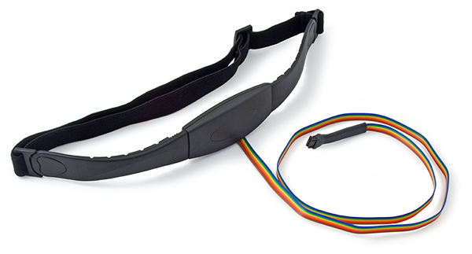

eHealth Body Position Sensor uses a triple axis accelerometer to obtain the patient’s position.

**Features:**

- 1.95 V to 3.6 V supply voltage
- 1.6 V to 3.6 V interface voltage
- ±2g/±4g/±8g dynamically selectable full-scale


This accelerometer is packed with embedded functions with flexible user programmable options, configurable to two interrupt pins.The accelerometer has user selectable full scales of ±2g/±4g/±8g with high pass filtered data as well as non filtered data available real-time.

**Body position**


#### Connecting the sensor


The body position sensor has only one and simple way of connection. Connect the ribbon cable with the body position sensor and the e-Health board as show in the image below.


Place the tape around the chest and the connector placed down

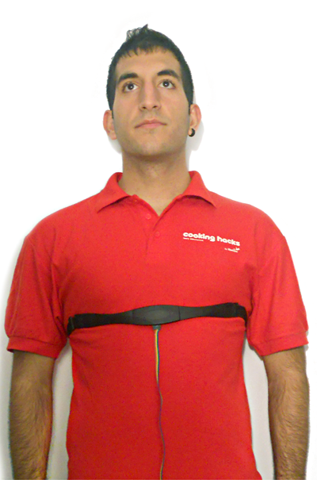

#### Library functions


The e-Health library allows a simple programing way. With one simple function we can get the position of the patient and show it in the serial monitor of the Arduino/RasberryPi or in the GLCD.

**Initializing the sensor**

Before start using the sensor, we have to initialize some parameters. Use the next function to configure the sensor.

**Example**

```cpp
{
	eHealth.initPositionSensor();
}
```

**Getting data**

The next functions return the a value that represent the body position stored in private variables of the e-Health class.

**Example**

```cpp
{
	uint8_t position = eHealth.getBodyPosition();
}
```

**The position of the pacient**

1 == Supine position.

2 == Left lateral decubitus.

3 == Rigth lateral decubitus.

4 == Prone position.

5 == Stand or sit position.

**Printing Data**

For representing the data in a easy way in the Arduino/RasberryPi serial monitor, e-health library, includes a printing function.

**Example:**

```cpp
{
	Serial.print("Current position : ");
	uint8_t position = eHealth.getBodyPosition();
	eHealth.printPosition(position);
}
```

#### Example


**Arduino**

Upload the next code for seeing data in the serial monitor:

```cpp
/*  
 *  eHealth sensor platform for Arduino and Raspberry from Cooking-hacks.
 *  
 *  Copyright (C) Libelium Comunicaciones Distribuidas S.L. 
 *  http://www.libelium.com 
 *  
 *  This program is free software: you can redistribute it and/or modify 
 *  it under the terms of the GNU General Public License as published by 
 *  the Free Software Foundation, either version 3 of the License, or 
 *  (at your option) any later version. 
 *  a
 *  This program is distributed in the hope that it will be useful, 
 *  but WITHOUT ANY WARRANTY; without even the implied warranty of 
 *  MERCHANTABILITY or FITNESS FOR A PARTICULAR PURPOSE.  See the 
 *  GNU General Public License for more details.
 *  
 *  You should have received a copy of the GNU General Public License 
 *  along with this program.  If not, see http://www.gnu.org/licenses/. 
 *  
 *  Version:           2.0
 *  Design:            David Gascón 
 *  Implementation:    Luis Martin & Ahmad Saad
 */


#include < eHealth.h >

void setup() {

  Serial.begin(115200);
  eHealth.initPositionSensor();
}

void loop() {

  Serial.print("Current position : ");
  uint8_t position = eHealth.getBodyPosition();
  eHealth.printPosition(position);

  Serial.print("\n");
  delay(1000); //	wait for a second.
}
```

Upload the code and watch the Serial monitor.Here is the USB output using the Arduino IDE serial port terminal:

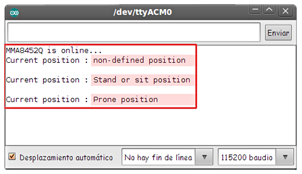

**Raspberry Pi**

```cpp
/*  
 *  eHealth sensor platform for Arduino and Raspberry from Cooking-hacks.
 *  
 *  Copyright (C) Libelium Comunicaciones Distribuidas S.L. 
 *  http://www.libelium.com 
 *  
 *  This program is free software: you can redistribute it and/or modify 
 *  it under the terms of the GNU General Public License as published by 
 *  the Free Software Foundation, either version 3 of the License, or 
 *  (at your option) any later version. 
 *  a
 *  This program is distributed in the hope that it will be useful, 
 *  but WITHOUT ANY WARRANTY; without even the implied warranty of 
 *  MERCHANTABILITY or FITNESS FOR A PARTICULAR PURPOSE.  See the 
 *  GNU General Public License for more details.
 *  
 *  You should have received a copy of the GNU General Public License 
 *  along with this program.  If not, see http://www.gnu.org/licenses/. 
 *  
 *  Version:           2.0
 *  Design:            David Gascón 
 *  Implementation:    Luis Martin & Ahmad Saad
 */

//Include eHealth library
#include < eHealth.h >

void setup(){
	eHealth.initPositionSensor();
}

void loop(){
	printf("Current position : \n");
	uint8_t position = eHealth.getBodyPosition();
	eHealth.printPosition(position);

	printf("\n");
	delay(3000);
}

int main (){
	setup();
	while(1){
		loop();
	}
	return (0);
}
```

**Mobile App**

The App shows the information the nodes are sending which contains the sensor data gathered Smartphone app


**GLCD**

The GLCD shows the information the nodes are sending which contains the sensor data gathered.GLCD

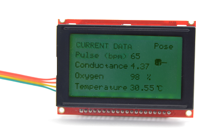

### Galvanic Skin Response (GSR)


#### GSR sensor features


Skin conductance, also known as galvanic skin response (GSR) is a method of measuring the electrical conductance of the skin, which varies with its moisture level. This is of interest because the sweat glands are controlled by the sympathetic nervous system, so moments of strong emotion, change the electrical resistance of the skin. Skin conductance is used as an indication of psychological or physiological arousal, The Galvanic Skin Response Sensor (GSR – Sweating) measures the electrical conductance between 2 points, and is essentially a type of ohmmeter.

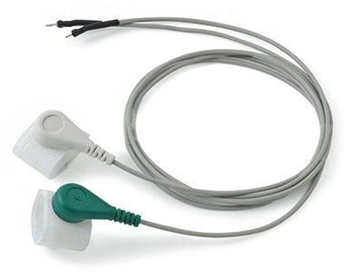

In skin conductance response method, conductivity of skin is measured at fingers of the palm. The principle or theory behind functioning of galvanic response sensor is to measure electrical skin resistance based on sweat produced by the body. When high level of sweating takes place, the electrical skin resistance drops down. A dryer skin records much higher resistance. The skin conductance response sensor measures the psycho galvanic reflex of the body. Emotions such as excitement, stress, shock, etc. can result in the fluctuation of skin conductivity. Skin conductance measurement is one component of polygraph devices and is used in scientific research of emotional or physiological arousal.

#### Sensor Calibration


The precision of the sensor is enough in most applications. But you can improve this precision by a calibration process.

When using temperature sensor, you are actually measuring a voltage, and relating that to what the operating temperature of the sensor must be. If you can avoid errors in the voltage measurements, and represent the relationship between voltage and temperature more accurately, you can get better temperature readings.

Calibration is a process of measuring real voltage values. In the eHealth.cpp file we can find getSkinConductance and getSkinResistance functions. The value 0.5 is imprecisely defined by default.

If you measure this voltage value with a multimeter and modify the library will obtain greater accuracy.

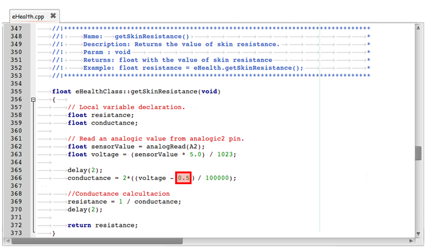

Place multimeter ends between 0.5V (Red cable) and GND (Black cable). In this case we would modify 0.5 to 0.498.


#### Connecting the sensor


Connect the to wires in the GSR contacts. The contacts have not polarization.


The galvanic skin sensor has two contacts and it works like a ohmmeter measuring the resistance of the materials. Place your fingers in the metallic contacts and tighten the velcro as shown in the image below.


#### Library functions


**Getting data**

With this simple functions we can read the value of the sensor. The library returns the value of the skin resistance and the skin conductance.

**Example:**

```cpp
{
	float conductance = eHealth.getSkinConductance();
	float resistance = eHealth.getSkinResistance();
 	float conductanceVol = eHealth.getSkinConductanceVoltage();
}
```

#### Example


**Arduino**

Upload the next code for seeing data in the serial monitor:

```cpp
/*  
 *  eHealth sensor platform for Arduino and Raspberry from Cooking-hacks.
 *  
 *  Copyright (C) Libelium Comunicaciones Distribuidas S.L. 
 *  http://www.libelium.com 
 *  
 *  This program is free software: you can redistribute it and/or modify 
 *  it under the terms of the GNU General Public License as published by 
 *  the Free Software Foundation, either version 3 of the License, or 
 *  (at your option) any later version. 
 *  a
 *  This program is distributed in the hope that it will be useful, 
 *  but WITHOUT ANY WARRANTY; without even the implied warranty of 
 *  MERCHANTABILITY or FITNESS FOR A PARTICULAR PURPOSE.  See the 
 *  GNU General Public License for more details.
 *  
 *  You should have received a copy of the GNU General Public License 
 *  along with this program.  If not, see http://www.gnu.org/licenses/. 
 *  
 *  Version:           2.0
 *  Design:            David Gascón 
 *  Implementation:    Luis Martin & Ahmad Saad
 */

//Include eHealth library
#include < eHealth.h >

void loop() {

  float conductance = eHealth.getSkinConductance();
  float resistance = eHealth.getSkinResistance();
  float conductanceVol = eHealth.getSkinConductanceVoltage();

  printf("Conductance : %f \n", conductance);
  printf("Resistance : %f \n", resistance);
  printf("Conductance Voltage : %f \n", conductanceVol);

  printf("\n");

  // wait for a second
  delay(1000);
}

int main (){
	//setup();
	while(1){
		loop();
	}
	return (0);
}
```

Source: e-Health Sensor Platform V2.0 for Arduino and Raspberry Pi [Biometric / Medical Applications]

## Quick Solutions to Questions related to e-Health Sensor Platform:


- **What is MySignals compared to eHealth v2?**

MySignals is the new generation with 16 improved sensors, integrated WiFi/BLE, TFT touchscreen, cloud storage, mobile apps, and certifications versus eHealth v2.
- **Can I use the e-Health Sensor Shield with Raspberry Pi?**

Yes, but you need the Raspberry Pi to Arduino shields connection bridge adapter and the ArduPi libraries.
- **How many sensors does the e-Health Sensor Shield support?**

The e-Health Sensor Shield V2.0 supports 10 sensors; MySignals supports 16 sensors.
- **Does the platform provide libraries for Arduino and Raspberry Pi?**

Yes, there are e-Health libraries for Arduino and for Raspberry Pi (which require the arduPi library).
- **How do I read SPO2 and BPM with the library?**

Initialize the pulsioximeter, attach the PinChangeInt interruption, call eHealth.readPulsioximeter(), then use eHealth.getOxygenSaturation() and eHealth.getBPM().
- **Can the sphygmomanometer, LCD, and communication modules work simultaneously?**

No, the LCD, the sphygmomanometer and communication modules use the UART port and cannot work simultaneously.
- **What sensors cannot be used at the same time?**

The EMG sensor and the ECG cannot work simultaneously; use jumpers to select one.
- **How is body temperature measured and improved?**

The temperature sensor returns a voltage converted to temperature; precision can be improved by measuring resistor and reference voltage values and updating the library calibration constants.
- **How can blood pressure data be obtained from the sphygmomanometer?**

Call eHealth.readBloodPressureSensor(), then use eHealth.getBloodPressureLength(), eHealth.getSystolicPressure(i), and eHealth.getDiastolicPressure(i) to access stored measures.
- **What communications and storage options does the platform offer?**

Data can be sent via Wi-Fi, Bluetooth, ZigBee/802.15.4, GPRS, 3G or stored and browsed in the Cloud; MySignals adds integrated WiFi/BLE and Cloud storage with mobile apps.
